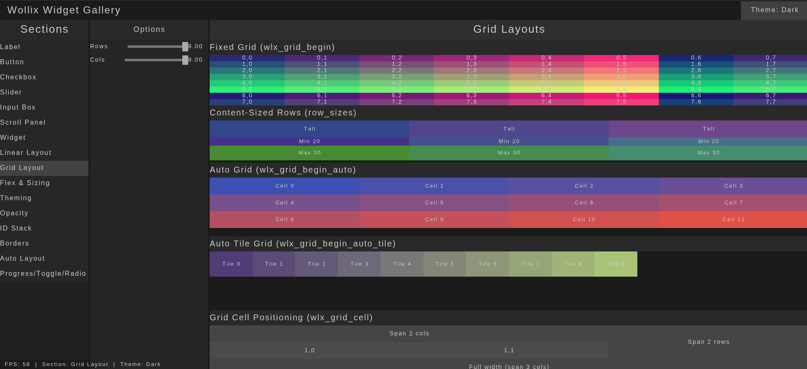

# Wollix

[](https://github.com/dberzins/wollix/actions/workflows/ci.yml)

> **Warning:** This library is a work in progress. The API is not stable and may change without notice. Use at your own risk.

**Woven layouts for C.**

Wollix is a lightweight, header-only C library for building immediate-mode UI
layouts. Define rows, columns, and grids — widgets interlock into place.



Live gallery demo: [https://dberzins.github.io/wollix/](https://dberzins.github.io/wollix/)

- Single header: [wollix.h](wollix.h)
- Zero dependencies in the core library
- Backend adapters for Raylib, SDL3, and bare WASM32 included
- Built-in widgets and compound helpers: labels, buttons, checkboxes,
    toggles, radios, input boxes, sliders, progress bars, separators, scroll
    panels, panels, split layouts, and fixed/auto-growing grid helpers
- Current version: `WOLLIX_VERSION` = `"0.3.0"`

## Quick Start

```c
#include <stdio.h>
#include <raylib.h>
#define WOLLIX_IMPLEMENTATION
#include "wollix.h"
#include "wollix_raylib.h"

int main(void) {
    InitWindow(800, 600, "Hello wollix.h");
    SetTargetFPS(60);

    WLX_Context ctx = {0};
    wlx_context_init_raylib(&ctx);

    float slider_val = 0.5f;
    bool  checked    = false;

    while (!WindowShouldClose()) {
        WLX_Rect root = {0, 0, GetRenderWidth(), GetRenderHeight()};
        wlx_begin(&ctx, root, wlx_process_raylib_input);

        BeginDrawing();
        ClearBackground((Color){18, 18, 18, 255});

        wlx_layout_begin(&ctx, 4, WLX_VERT, .padding = 8);

            wlx_label(&ctx, "Hello, wollix.h!", .font_size = 24, .align = WLX_CENTER);

            if (wlx_button(&ctx, "Click me", .height = 40))
                printf("clicked!\n");

            wlx_checkbox(&ctx, "Enable feature", &checked);

            wlx_slider(&ctx, "Volume", &slider_val,
                .min_value = 0.0f, .max_value = 1.0f);

        wlx_layout_end(&ctx);

        wlx_end(&ctx);
        EndDrawing();
    }

    wlx_context_destroy(&ctx);
    CloseWindow();
}
```

Compile with:
```bash
clang -I. -I ~/opt/raylib/include -o hello hello.c \
      -L ~/opt/raylib/lib -lraylib -lm -lpthread -ldl -lrt -lX11
```

## Optional short aliases

The canonical API uses `wlx_` prefixes. If you prefer terser names, define
`WLX_SHORT_NAMES` before including [wollix.h](wollix.h):

```c
#define WLX_SHORT_NAMES
#include "wollix.h"

layout_begin(&ctx, 2, WLX_VERT);
button(&ctx, "OK");
layout_end(&ctx);
```

## Project Structure

| Path | Contents |
|------|----------|
| `wollix.h` | Core header-only library |
| `wollix_raylib.h` | Raylib backend adapter |
| `wollix_sdl3.h` | SDL3 backend adapter |
| `wollix_wasm.h` | Bare WASM32 backend adapter (no libc) |
| `web/` | WASM host runtime, HTML shell, and libc shim |
| `docs/` | API reference, layout model, widget guide, opacity guide |
| `demos/` | Standalone demo programs (one per feature) |
| `tests/` | Unit test suite |

## Dependencies

- **Raylib**: Graphics library installed in `~/opt/raylib/`
- **SDL3** (optional): Needed only for `sdl3_demo` target
- **SDL3_ttf** (optional): Needed for TTF font rendering in the SDL3 backend
- **Clang** (for WASM): The `wasm-site` target requires `clang` with wasm32 support and `lld`

> **Note:** The build files assume Raylib is installed in `~/opt/raylib/`,
> SDL3 in `~/opt/sdl3/`, and SDL3_ttf in `~/opt/sdl3_ttf/`.
> If your installations are in different locations, update the paths in
> `Makefile` accordingly.

## Text Rendering

The Raylib and SDL3 backends support real TTF font rendering:

- **Raylib**: pass a `Font*` via `wlx_font_from_raylib()`
- **SDL3**: pass a `TTF_Font*` via `wlx_font_from_sdl3()` (requires SDL3_ttf)
- **WASM**: text rendering is handled by the JavaScript host via canvas 2D

When no font is set (`WLX_FONT_DEFAULT`), the SDL3 backend falls back to the
built-in 8×8 debug font. The Raylib backend uses its default font.

**Limitations:** Wollix provides real TTF font rendering, not a full typography
engine. Basic Latin and UTF-8 text renders correctly with proper sizing, but
advanced features like kerning, ligatures, complex script shaping, and
bidirectional text are not supported. Text layout is codepoint-by-codepoint,
not shaped-run based.

## Available Widgets

The library includes the following widgets and layout/container primitives:

- **Button** - Clickable button widget with hover effects
- **Label** - Static text display with wrapping and alignment
- **Checkbox** - Toggle checkbox with text label and optional checked/unchecked textures
- **Toggle** - On/off switch widget with animated thumb/track styling
- **Radio** - Single-choice radio control with label alignment options
- **Input Box** - Text input field with cursor and selection
- **Slider** - Value slider with label and drag interaction
- **Progress Bar** - Read-only progress indicator with theme-aware track/fill styling
- **Separator** - Horizontal or vertical divider for grouping related controls
- **Scrollable Panel** - Vertical scrolling container for long content
- **Split** - Two-pane compound layout with independent scroll panels
- **Panel** - Capacity-based compound layout with optional heading
- **Linear layouts** - Horizontal and vertical slot-based layouting
- **Grid layouts** - Fixed and auto-growing grid layout helpers

## Building

### Using Makefile

```bash
make                # Build all Raylib demos (default)
make test           # Build and run the unit test suite
make test-demos     # Build all Raylib demos and verify they compile
make all            # Build all
make sdl3_demo      # Build the SDL3 backend demo
make wasm-site      # Package the WASM gallery demo into dist/wasm-demo/
make debug          # Build demos/layout with debug flags
make release        # Build demos/layout with release optimization
make clean          # Remove all built executables
make help           # Show all available targets
```

Build a single demo by name:

```bash
make button         # → demos/button
make grid           # → demos/grid
make slider         # → demos/slider
```

All executables are written to `./demos/`.

### Using the original build script

```bash
./build.sh
```

