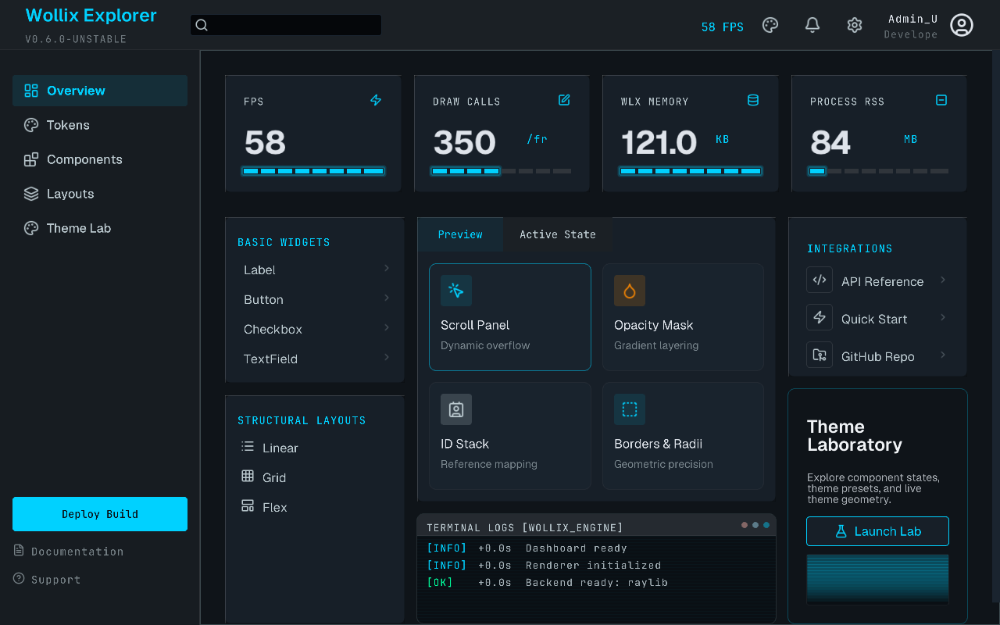
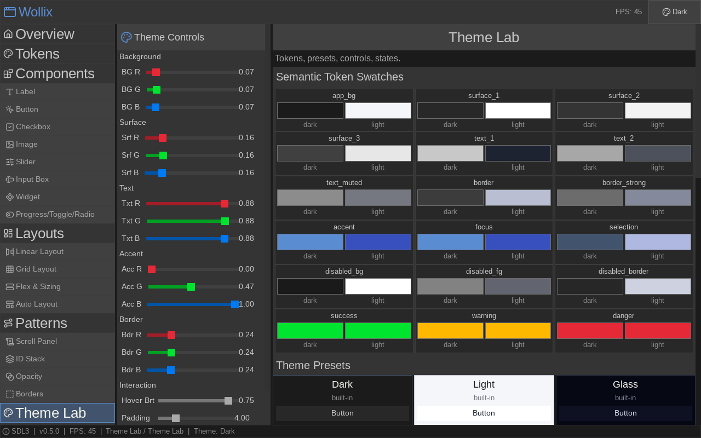

# Wollix

[](https://github.com/dberzins/wollix/actions/workflows/ci.yml)

> **Warning:** This library is a work in progress. The API is not stable and may change without notice. Use at your own risk.

**Woven layouts for C.**

Wollix is a lightweight, header-only C library for building immediate-mode UI
layouts. Define rows, columns, and grids — widgets interlock into place.

[](https://dberzins.github.io/wollix/)

The dashboard is the primary Wollix showcase. Try the live demo:
[https://dberzins.github.io/wollix/](https://dberzins.github.io/wollix/)

- Single header: [wollix.h](wollix.h)
- Zero dependencies in the core library
- Backend adapters for Raylib, SDL3, and bare WASM32 included
- Built-in widgets and compound helpers: labels, buttons, checkboxes,
    toggles, radios, input boxes and multiline textareas, sliders, progress
    bars, images, separators, scroll panels, panels, split layouts, list
    clipper for virtualized rows, and fixed/auto-growing grid helpers
- Popups on overlay layers: dropdowns, tooltips, menus with submenus and
    button-anchored menus, plus `wlx_overlay` for custom layered subtrees;
    the topmost widget under the pointer owns the press and the hover
- Input contract with left/right/middle buttons, float wheel on both axes,
    F-keys, keyboard focus traversal (Tab ring, Enter/Space activation,
    focus ring), and an optional backend cursor-shape callback
- Windowed text editor extension ([wollix_editor.h](wollix_editor.h)):
    document-scale editing at O(viewport) frame cost up to 10 MB / 1M lines
- Undo/redo in every text widget (inputbox, textarea, editor): a bounded
    per-widget journal with typing-run coalescing and exact caret restore
- Container decoration: per-side borders, per-corner rounding, vertical
    gradient fills, and glow/shadow effects
- Current version: `WOLLIX_VERSION` = `"0.8.0"`

## Quick Start

```c
#include <stdio.h>
#include <raylib.h>
#define WOLLIX_IMPLEMENTATION
#include "wollix.h"
#include "wollix_raylib.h"

int main(void) {
    InitWindow(800, 600, "Hello wollix.h");
    SetTargetFPS(60);

    WLX_Context ctx = {0};
    wlx_context_init_raylib(&ctx);

    float slider_val = 0.5f;
    bool  checked    = false;

    while (!WindowShouldClose()) {
        WLX_Rect root = {0, 0, GetRenderWidth(), GetRenderHeight()};
        wlx_begin(&ctx, root, wlx_process_raylib_input);

        BeginDrawing();
        ClearBackground((Color){18, 18, 18, 255});

        wlx_layout_begin(&ctx, 4, WLX_VERT, .padding = 8);

            wlx_label(&ctx, "Hello, wollix.h!", .font_size = 24, .content_align = WLX_CENTER);

            if (wlx_button(&ctx, "Click me", .height = 40))
                printf("clicked!\n");

            wlx_checkbox(&ctx, "Enable feature", &checked);

            wlx_slider(&ctx, "Volume", &slider_val,
                .min_value = 0.0f, .max_value = 1.0f);

        wlx_layout_end(&ctx);

        wlx_end(&ctx);
        EndDrawing();
    }

    wlx_context_destroy(&ctx);
    CloseWindow();
}
```

Compile with:
```bash
clang -I. -Wno-initializer-overrides -I ~/opt/raylib/include -o hello hello.c \
      -L ~/opt/raylib/lib -lraylib -lm -lpthread -ldl -lrt -lX11
```

The wollix call style deliberately overrides default initializers (that is
how `.height = 40`-style named options work), so silence the corresponding
warning: `-Wno-initializer-overrides` on clang (it warns even without
`-Wextra`), `-Wno-override-init` on gcc (needed with `-Wextra`).

## Optional short aliases

The canonical API uses `wlx_` prefixes. If you prefer terser names, define
`WLX_SHORT_NAMES` before including [wollix.h](wollix.h):

```c
#define WLX_SHORT_NAMES
#include "wollix.h"

layout_begin(&ctx, 2, WLX_VERT);
button(&ctx, "OK");
layout_end(&ctx);
```

## Project Structure

| Path | Contents |
|------|----------|
| `wollix.h` | Core header-only library |
| `wollix_raylib.h` | Raylib backend adapter |
| `wollix_sdl3.h` | SDL3 backend adapter |
| `wollix_wasm.h` | Bare WASM32 backend adapter (no libc) |
| `wollix_editor.h` | `wlx_editor` extension header (windowed text editor; include after `wollix.h`) |
| `web/` | WASM host runtime, HTML shell, and libc shim |
| `docs/` | Performance diagnostics guide, design system guide (canonical: core theme contract + dashboard "Mechanical Glass"), gallery design system guide (secondary), API reference, layout model, line run model (text handling), editor model (windowed text editor), undo model (the text undo journal), widget guide, opacity guide, core patterns guide, sentinel rules |
| `demos/` | Standalone demo translation units (one per feature); `gallery.c` also includes the local `gallery_perf.h` benchmark companion header |
| `tests/` | Unit test suite |

## Dependencies

- **Raylib**: Graphics library installed in `~/opt/raylib/`
- **SDL3** (optional): Needed only for `sdl3_demo` target
- **SDL3_ttf** (optional): Needed for TTF font rendering in the SDL3 backend
- **Clang** (for WASM): The `wasm-site` target requires `clang` with wasm32 support and `lld`

> **Note:** The build files assume Raylib is installed in `~/opt/raylib/`,
> SDL3 in `~/opt/sdl3/`, and SDL3_ttf in `~/opt/sdl3_ttf/`.
> If your installations are in different locations, update the paths in
> `Makefile` accordingly.

## Text Rendering

The Raylib and SDL3 backends support real TTF font rendering:

- **Raylib**: pass a `Font*` via `wlx_font_from_raylib()`
- **SDL3**: pass a `TTF_Font*` via `wlx_font_from_sdl3()` (requires SDL3_ttf)
- **WASM**: text rendering is handled by the JavaScript host via canvas 2D

When no font is set (`WLX_FONT_DEFAULT`), the SDL3 backend falls back to the
built-in 8×8 debug font. The Raylib backend uses its default font.

**Limitations:** Wollix provides real TTF font rendering, not a full typography
engine. Normal fitted widget text is measured and drawn as whole visible
lines/runs, so backend-native spacing and kerning can participate when the
backend supports them. Wrapping remains a greedy UTF-8 codepoint-boundary
model, explicit `\n`, `\r\n`, and `\r` create visual line breaks, and Wollix
does not provide grapheme-aware cursoring, complex-script shaping, or
bidirectional text.

**Text entry** targets ASCII and European keyboard layouts: there is no
input-method (IME) or composition support, so no inline preedit is drawn,
and on the web host IME and dead-key input produce no text at all.

## Available Widgets

The library includes the following widgets and layout/container primitives:

- **Button** - Clickable button widget with hover effects
- **Label** - Static text display with wrapping and alignment
- **Checkbox** - Toggle checkbox with text label and optional checked/unchecked textures
- **Toggle** - On/off switch widget with themed thumb/track styling
- **Radio** - Single-choice radio control with label alignment options
- **Input Box** - Text input field with full editing: caret, selection,
  clipboard, word motion, undo/redo, and password / read-only modes
- **Textarea** - Multiline input (`wlx_textarea` / `.multiline`) with Enter
  handling, sticky-column caret motion, and internal scrolling
- **Editor** - Windowed text editor (`wlx_editor`, via the `wollix_editor.h`
  extension header) over a caller-owned buffer: wrapped and no-wrap modes,
  line-number gutter, undo/redo, O(viewport) frames up to the 10 MB /
  1M-line envelope
- **Slider** - Value slider with label and drag interaction
- **Progress Bar** - Read-only progress indicator with continuous or segmented track/fill styling
- **Image** - Draw a `WLX_Texture` in a slot with scale modes (stretch/fit/fill/none) and alignment
- **Separator** - Horizontal or vertical divider for grouping related controls
- **Dropdown** - Closed face that opens a below-anchored, scrollable option list on the next layer
- **Tooltip** - Hover-delayed, pointer-anchored, draw-only tip (`wlx_tooltip_for` + `wlx_last_rect`)
- **Menu** - Point-anchored or button-anchored (`wlx_menu_button_begin`) item list with nested submenus
- **Overlay** - Absolutely positioned layered subtree that escapes base clipping and wins input
- **Scrollable Panel** - Vertical scrolling container for long content
- **List Clipper** - Row virtualization helper that builds only visible rows inside a scroll panel
- **Split** - Two-pane compound layout with independent scroll panels
- **Panel** - Capacity-based compound layout with optional heading
- **Linear layouts** - Horizontal and vertical slot-based layouting
- **Grid layouts** - Fixed and auto-growing grid layout helpers

## Secondary demo: widget gallery

The widget gallery is the secondary, cross-backend reference demo: it exercises
the full public widget and layout surface across Raylib, SDL3, and bare WASM.
The dashboard above is the primary showcase.

[](https://dberzins.github.io/wollix/gallery/)

Try the live gallery:
[https://dberzins.github.io/wollix/gallery/](https://dberzins.github.io/wollix/gallery/)

Build it with `make gallery` (Raylib), `make gallery_sdl3` (SDL3), or
`make gallery-wasm-site` (bare WASM into `dist/gallery-demo/`).

## Themes & Design System

Wollix ships three built-in theme presets: `dark`, `light`, and `glass`.
Callers can set `ctx.theme` per frame, start from a built-in preset, and
create custom themes by overriding the fields they need.

For the full theme model, inheritance rules, semantic color guidance, and
custom-theme examples, see [docs/DESIGN_SYSTEM.md](docs/DESIGN_SYSTEM.md).
For a working runtime theme builder, see [demos/theme_demo.c](demos/theme_demo.c).
For visual theme exploration, use the live dashboard showcase:
[https://dberzins.github.io/wollix/](https://dberzins.github.io/wollix/).

## Performance Diagnostics

Wollix ships an opt-in `WLX_PERF` diagnostics channel for frame timings,
command histograms, text counters, arena high-water marks, allocator stats,
and backend-specific counters.

For build targets, gallery benchmark commands, and output interpretation, see
[docs/PERFORMANCE_DIAGNOSTICS.md](docs/PERFORMANCE_DIAGNOSTICS.md).

## Building

### Using Makefile

```bash
make                # Build all Raylib demos + the dashboard showcase (default)
make test           # Build and run the unit test suite
make perf-test      # Build and run the unit test suite with WLX_PERF enabled
make perf-editor    # Run the editor perf gate (frame cost + measure traffic)
make test-demos     # Build all Raylib demos + the dashboard and verify they compile
make all            # Build all Raylib demos + the dashboard (same as bare make)
make sdl3_demo      # Build the SDL3 backend demo
make gallery_perf   # Build the Raylib gallery with WLX_PERF enabled
make gallery_sdl3_perf # Build the SDL3 gallery with WLX_PERF enabled
make dashboard      # Build the dashboard showcase (Raylib)
make wasm-site      # Package the WASM dashboard showcase into dist/wasm-demo/ (the published site)
make gallery-wasm-site # Package the WASM gallery into dist/gallery-demo/ (coexisting reference)
make debug          # Build demos/layout with debug flags
make release        # Build demos/layout with release optimization
make clean          # Remove all built executables
make help           # Show all available targets
```

Build a single demo by name:

```bash
make button         # → demos/button
make grid           # → demos/grid
make slider         # → demos/slider
make editor         # → demos/editor (100 KB / 10 MB generated docs, W toggles wrap)
```

All executables are written to `./demos/`.

## Contributing

Wollix is experimental and the API is not yet stable — **code contributions
(PRs) are not being accepted before v1.0.0.** Bug reports, API feedback, and
platform reports (Windows/macOS build attempts especially) are very welcome
as issues. See [CONTRIBUTING.md](CONTRIBUTING.md) for details.

