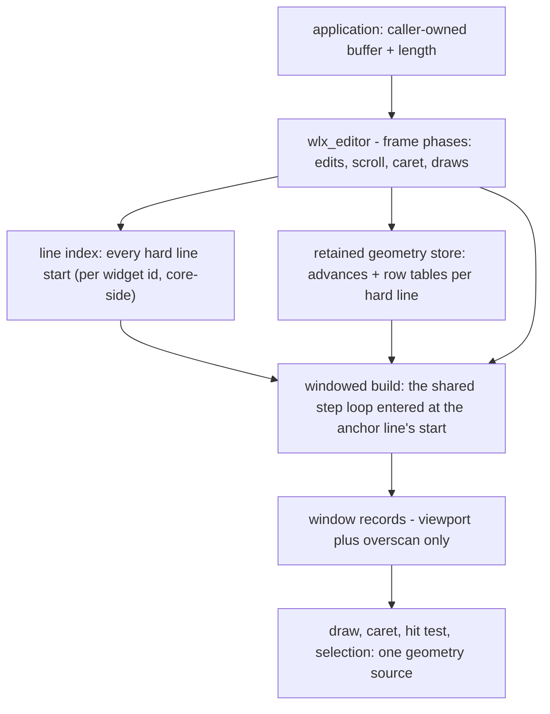
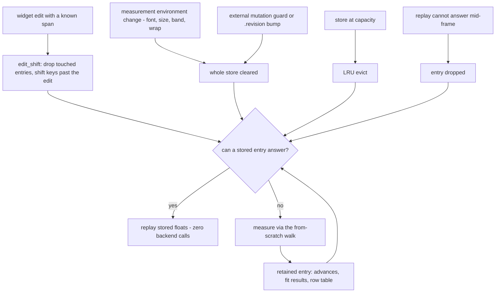

# Editor Model

> **Companion to [LINE_RUN_MODEL.md](LINE_RUN_MODEL.md).** The core text
> pipeline — line records, the build step, budgets, tab passthrough, and
> the backend contract — is documented there and stays canonical; this
> document covers `wlx_editor` (`wollix_editor.h`): the windowed-text
> machinery built on that pipeline.

How `wlx_editor` turns the shared line-run pipeline into a windowed text
editor: O(viewport) frame cost at any document size, retained per-line
geometry, horizontal windowing for giant lines, and wrapped-mode rows.
Read it before extending the editor (syntax highlighting, keymaps,
large-file work) or debugging editor geometry.

Audience: application developers embedding the editor and contributors
working on it. The widget's API surface is in `docs/API_REFERENCE.md`
and `docs/WIDGETS.md`; internal names here are for orientation —
everything not marked `WLXDEF` is private and may change. For a
code-level region map, the editor frame's phase order, and the
invariant registry contributors must preserve, see
[TEXT_PIPELINE_MAP.md](TEXT_PIPELINE_MAP.md).

---

## Table of Contents

1. [Overview: The Editor as a Pipeline Consumer](#1-overview-the-editor-as-a-pipeline-consumer)
2. [The Line Index](#2-the-line-index)
3. [Build-from-Offset: The Windowed Build](#3-build-from-offset-the-windowed-build)
4. [Retained Line Geometry](#4-retained-line-geometry)
5. [Truncate-and-Continue with a Virtual Width](#5-truncate-and-continue-with-a-virtual-width)
6. [The Windowed Horizontal Origin](#6-the-windowed-horizontal-origin)
7. [Wrapped Mode](#7-wrapped-mode)
8. [Tab Expansion](#8-tab-expansion)
9. [Performance](#9-performance)
10. [Configuration](#10-configuration)
11. [Per-Span Colour](#11-per-span-colour)

---

## 1. Overview: The Editor as a Pipeline Consumer

`wlx_editor` is the document-scale consumer of the line-run pipeline.
The widget ships in the companion header `wollix_editor.h` (included
after `wollix.h` in every TU that uses it — see the include contract in
`docs/WIDGETS.md`); the machinery it rests on — the line index types,
the retained geometry store, and the build-step extensions — lives in
the core, where the shared pipeline and the selection draw consume it.

The document is a caller-owned flat buffer with an explicit length
passed in and out; the widget never derives length from the bytes. NUL
termination is maintained opportunistically for interop but is never
the length source. Edits are memmove-based, and the library never
copies or owns the document.

The target envelope is a 10 MB / 1,000,000-line document — including a
single 300 KB hard line, editable end-to-end — with per-frame cost
proportional to the viewport and independent of document size, scroll
depth, and caret position. The sections below are the additions that
make that possible; none of them changed the record model or the
behavior of any other widget.

Every offset the editor holds — caret, anchor, hit-test result, measure
origin, stored unit end — is a byte offset on a text-unit boundary, and
a text unit is the approximated grapheme cluster of
[LINE_RUN_MODEL.md §3](LINE_RUN_MODEL.md#3-text-units-and-utf-8-policy):
caret motion, Backspace and Delete, clicks, drags and the vertical
sticky column never land inside a combining sequence, a ZWJ emoji or a
flag, and one Backspace removes the whole cluster.

The pieces and who feeds whom:



---

## 2. The Line Index

Per open editor id, the context owns a lazily grown array of the byte
offsets of every hard line start (offset 0 plus one entry after each
separator). The index makes document geometry pure arithmetic:

- `content_h = line_count * line_h` — the vertical scrollbar is exact
  from counting alone, with zero measuring (wrapped mode ends its range
  at the bottom anchor instead — Section 7).
- The caret's line is a binary search of the index by byte offset.
- The scroll anchor is `(first_line, y_frac)` — a line number plus a
  fractional line — never a document-height pixel float, so precision
  holds at any document height.

The index is rebuilt by a single newline scan on any edit the widget
applies (no incremental patching), and external buffer mutation between
frames is caught by a cheap guard (length change or boundary-byte probe)
plus the explicit `.revision` opt as the escape hatch. Idle frames pay no
scan: no O(document) work of any kind happens on a frame without an edit.
The undo journal (shared with the inputbox through the same key handler)
rides the same guard: a rebuild the widget's own edit did not cause drops
the history with the geometry, and an undo or redo is an ordinary edit to
the index, its span shifting the retained geometry exactly like a
keystroke. The journal itself is documented in
[UNDO_MODEL.md](UNDO_MODEL.md).

---

## 3. Build-from-Offset: The Windowed Build

Each frame, the editor builds records only for the visible lines plus a
small overscan (`WLX_EDITOR_OVERSCAN_LINES`, default 2), entering the
standard step loop at `line_index[first_line]`. Re-entrancy at hard line
starts ([LINE_RUN_MODEL.md §5](LINE_RUN_MODEL.md#5-the-line-build-pipeline))
guarantees these records match what a full-document build would produce.

---

## 4. Retained Line Geometry

Windowing bounds how much text a frame measures; retention makes the
next frame stop measuring it again. Next to the line index, the same
per-id cache holds a **retained geometry store**: one entry per hard
line the window has touched, holding the line's cumulative unit-advance
array ([LINE_RUN_MODEL.md §5](LINE_RUN_MODEL.md#5-the-line-build-pipeline)),
its fit results, and — under `.wrap` — its row
table. Window builds, caret x, hit tests, selection spans, and wrapped
row walks replay these floats instead of re-asking the backend; a miss
or a reach extension measures through the same walk the from-scratch
build uses and lands in the store. Every consumer keeps the measuring
path as its miss fallback, so an evicted or dropped entry costs
traffic, never geometry.

Entries are valid for one measurement environment — font, size,
spacing, tab advance, band width, line height, wrap flag — snapshotted
each frame; any change clears the store (tens of entries, cheap to
rebuild, wrong geometry is not). Invalidation otherwise rides the
existing document-identity machinery:

- **Widget-applied edits** know their byte span and delta: entries
  touching the edited range drop, entries past it shift their byte
  keys by the delta. This is what makes a typing frame re-measure only
  the edited line.
- **External mutation** (the length/boundary guard or a `.revision`
  bump) and any other index rebuild clear the store outright — the
  safe default.

The store is LRU-bounded at about twice the window's line count
(minimum 16 entries; not an exposed knob), its allocations grow and are
reused but never freed per frame, and it is `WLX_MEMORY_DEBUG`-tracked.
The measured consequences, asserted by the `make perf-editor` traffic
gate: an idle or post-scroll steady frame issues zero line measures
(one reference measure for the frame's line height is all that
remains), a typing frame re-measures only the edited line, a vertical
scroll frame only the lines entering the window.

An entry's lifecycle — note that every exit path lands back on the
measuring fallback, which is why an invalidation can only ever cost
traffic, never geometry:



---

## 5. Truncate-and-Continue with a Virtual Width

The window builds at a virtual width of `scroll_x + 2 * viewport width`,
in no-wrap truncate-and-continue mode
([LINE_RUN_MODEL.md §7](LINE_RUN_MODEL.md#7-wrap-and-no-wrap-modes)): one
viewport shows, the second is a *measure lookahead*. Horizontal scrolling
is therefore also windowed — each line measures only up to the current
reach, and because retained entries extend in place, scrolling deeper
costs only the extension units, not a re-measure from the line start. The
horizontal scrollbar's proportion derives from the widest line
*measured so far* (monotonically sticky, on each record's
estimated-absolute right edge — see the windowed origin below): a
documented approximation, since exactness would require measuring the
entire document.

That approximation splits into two ranges with different jobs. The
*scroll limit* stays open one band past the current reach while a
visible line is width-truncated, so the view can keep moving into
unmeasured content. The *thumb*, however, maps only through the content
measured so far, floored at the visible span (`scroll_x + viewport
width`) — a function continuous in `scroll_x` and independent of the
reach flag. A thumb range that followed the open extension would snap
whenever the flag flips at a long line's end: one wheel notch back from
the end re-mapped the thumb far left and shrank it. The lookahead is
what keeps the flag-free range honest: the max-seen width runs a band
ahead of the view while a line is still truncated, so the thumb always
leaves drag room toward unmeasured content (without it the range
collapses onto the reach — a full-track thumb at `scroll_x` 0 with no
room to drag), the range grows smoothly as the line is discovered, and
the moment the lookahead finds the line's true end the range plateaus
there without a step.

The horizontal scrollbar's *visibility* follows the window's records (a
width-truncated record holds the range open), while the bar itself
shortens the band it is drawn under. To keep that from feeding back into
its own input, the window is sized from the pre-strip band height: the
set of lines the window considers depends only on the scroll position,
never on which scrollbars happen to be visible. Sizing it from the
post-strip band would let a long line at the window's bottom edge leave
the window when the bar appears and re-enter when it hides, blinking the
bar on alternating frames.

A thumb drag is the same feedback risk on the other axis: the drag maps
the pointer through the thumb range, whose reach floor follows
`scroll_x` — the drag's own output. Mapped through the live range, a
thumb held still would re-map to a new `scroll_x` every frame, creeping
or oscillating near a long line's end. The gesture therefore maps (and
draws) through the range frozen at the press; the live range takes over
on release and lands where the frozen one left off, since both derive
from the same measured content.

Caret and hit-test geometry away from the window (Ctrl+End, click after a
big scroll) come from index arithmetic plus on-demand single-line
records — which also populate the retained store — so motion works
anywhere in the document without building intermediate windows.

---

## 6. The Windowed Horizontal Origin

The per-record unit budget
([LINE_RUN_MODEL.md §11](LINE_RUN_MODEL.md#11-run-budgets)) means a
window record cannot
measure a whole giant line. What keeps such a line editable end-to-end
is that a record does not have to start measuring at the line start: in
no-wrap mode, once the budget cannot reach the view from the line
start, the record **re-enters the line at a measure origin near the
view** — the horizontal sibling of the wrapped row, which has always
measured from mid-line origins.

- **Origin selection.** The origin stays at the line start while the
  budget covers the view from there (near-content documents never move
  it, and records with origin zero reproduce the un-windowed records
  exactly). Beyond that, the origin advances so the measured window
  covers `[scroll_x - back_margin, scroll_x + 2 * band width]`
  (back margin: half a band). Origins snap to a unit boundary (a
  grapheme cluster edge, never inside a cluster), preferring the edge
  just after a space within a small backscan
  (`WLX_EDITOR_ORIGIN_BACKSCAN`, default 64 bytes). The gap estimate that
  places a far-jumped origin in x prices each unit at the entry's
  average advance, so a jump across a run of wide clusters (emoji) lands
  short in x while the offset stays exact — the same documented estimate
  class as the average-advance thumb.
- **One origin per window.** Each retained entry freezes its origin
  offset and the origin's absolute x; fit, caret, hit test, selection,
  and draw all compute `x = origin_x + advances[unit]` from the same
  entry, so geometry agrees within the window by construction. Tab
  stops restart at the origin — the same rule wrapped rows apply at
  row starts.
- **Hysteresis.** Origins re-anchor only when the view leaves what the
  current origin can measure (budget exhausted short of the view, or
  the view's left edge crossing the origin) — never per wheel notch. A
  held scroll position never re-anchors; steady frames at any depth
  replay retained geometry without measuring.
- **Views wider than a budget.** A band wider than a budget's worth of
  units (a very wide editor, a tiny font, or a lowered
  `WLX_EDITOR_MAX_LINE_UNITS`) cannot be covered from any origin, and
  the half-band back margin is then unaffordable. The origin aims at
  the view's left edge instead, so the whole budget lands inside the
  view, and it never advances past that edge — an origin the view
  starts behind is pulled back by the retreat rule on the next frame,
  and the two rules would otherwise trade the origin, and a full
  re-measure, every frame on a motionless view. The visible tail past
  the budget stays unmeasured: that is the budget's limit, not a policy
  choice.
- **Stitching and the far-jump estimate.** An origin advancing onto
  already-measured units stitches its absolute x exactly from the
  stored advances; a retreat within one budget re-measures the skipped
  span and subtracts. Only a far jump onto unmeasured content (END on
  a giant line) sets the origin's x by estimate — the measured average
  unit advance times the units before the origin. This estimated x is
  the model's one new approximation, confined to x-space like the
  scrollbar approximations around it: **byte offsets are exact
  everywhere, always.** A kern-sensitive eye may notice glyph spacing
  shift at a re-entry seam on far-scrolled proportional text.

Spatially, with the view deep inside a giant line:

```
   content x on one giant hard line ------------------------------->

   line start                                              line end
   |                                                              |
   v                                                              v
   +---------------------------//---------------------------------+
                 ^
                 | origin: unit-snapped, preferring the edge
                 | just after a space within the backscan
                 |
    unmeasured   |<- back  ->|<===== view =====>|<- lookahead ->|
    (skipped,    |   margin  | scroll_x ..      |   (one band)  |
    byte-walked  |  (half a  | scroll_x+band w  |               |
    only)        |   band)   |                  |               |
                 |<-- measured coverage: origin + at most ------>|
                 |    WLX_EDITOR_MAX_LINE_UNITS units            |

   origin_x: 0 at the line start, stitched exactly across moves
   over measured units, estimated (average advance) only after a
   far jump onto unmeasured content - byte offsets exact always.
```

The result, asserted by the perf gate's giant-line envelope: END on a
300 KB single-line document parks the view at the line's true end
(~2.46 million px), and wheel, steady, and typing cost at 600,000 px of
scroll depth is identical to the cost at 6,000 px.

---

## 7. Wrapped Mode

`.wrap` reuses the same windowed machinery with rows instead of
truncated lines: the window build enters at the anchor line's start with
`wrap = true` and the per-line budget
([LINE_RUN_MODEL.md §7](LINE_RUN_MODEL.md#7-wrap-and-no-wrap-modes)),
discards the rows
above the anchor's row component, and fills the band plus overscan. Hard
lines stay the only global coordinate system — the index is unchanged —
and rows are a strictly window-relative notion. Everything expensive is
bounded by two quantities: the viewport, and the per-line budget on any
single line's wrap cost. A retained entry (Section 4) keeps one advance
array plus a row table per hard line, so the row count, anchor
stepping/backfill, and window fill all replay the same stored geometry
instead of re-walking the line within a frame. No document-wide row
count is ever stored — the retained row tables clear with the
measurement environment — so band-width and font changes cost only an
anchor clamp and a store clear.

The anchor, the rows, and the band:

```
   hard lines (the index -            visual rows (window-relative,
   the global coordinates)            never stored document-wide)

   line 41 "The quick brown fox jumps over the lazy dog"
            |
            +-> row 0  "The quick brown "
                row 1  "fox jumps over "   <- anchor: (first_line 41,
                row 2  "the lazy dog"          first_row 1, y_frac 0.3)
   line 42 "next"
            +-> row 0  "next"

   +------------------------------+ <- band top sits y_frac * line_h
   | fox jumps over   (41, row 1) |    above the anchor row's top
   | the lazy dog     (41, row 2) |
   | next             (42, row 0) |    rows fill the band (plus
   +------------------------------+    overscan) from the anchor down
```

- The anchor grows a row component: `(first_line, first_row, y_frac)`.
- The wheel, drag auto-scroll, and caret-follow move the anchor in row
  space (heavily wrapped regions scroll evenly); far caret jumps
  re-anchor by filling a viewport of rows *backward* from the caret,
  which touches at most a viewport of lines because every line is at
  least one row.
- The bottom clamp is structural, not arithmetic: when the window shows
  the document tail ending above the band's bottom edge, the anchor
  moves to the **bottom anchor** — the `(line, row, y_frac)` that
  bottom-aligns the last row, filled backward from it over at most a
  band of lines — and the window rebuilds once; there is no exact
  wrapped content height to clamp against. The bottom anchor is cached
  in the editor state end-relative (its distance from the last line),
  so an edit before its line only shifts its start byte; an edit
  reaching it, a measurement-environment change, or a new band row
  count drops it, and the next use refills.
- The vertical thumb maps hard-line pseudo pixels (the anchor line plus
  its row fraction, times `line_h`, as if nothing wrapped) over a range
  that ends at the bottom anchor's pseudo scroll: continuous in the
  anchor, exact at both track ends (document start and document end)
  and throughout at wrap factor one (where the range is `line_count *
  line_h - band.h`), a documented approximation in between — the
  wrapped sibling of the horizontal bar's max-seen-width approximation.
  A range ending at `line_count * line_h - band.h` under wrap would sit
  lines above the real end, parking the thumb at the track end while
  the view scrolled back up through them.
- Rows end at word boundaries
  ([LINE_RUN_MODEL.md §7](LINE_RUN_MODEL.md#7-wrap-and-no-wrap-modes)):
  a row cuts after the latest space or tab that fit, and a word wider
  than the band breaks inside it. The editor builds in the editable
  whitespace mode: a space or tab that does not fit never hangs past the
  band — the row cuts at the previous space (the word before the
  whitespace moves down with it) or, with no earlier space, the
  whitespace opens the next row at column zero. Every row fits the band,
  a row may start with whitespace, and a row's trailing whitespace stays
  out of its alignment width.
- Vertical caret motion and hit-tests resolve through on-demand wrapped
  row records of the specific lines involved. A caret offset exactly at
  a wrap break belongs to the row it **starts** (rows that end their
  hard line keep separator and frozen-tail coverage) — with the opposite
  affinity, DOWN aiming at column zero could never cross a break. So the
  caret after a row's trailing space sits at column zero of the next
  row, and a click right of a row's last glyph lands there too; a caret
  inside trailing whitespace is always on a row inside the band and is
  always drawn.
- Horizontal machinery is dormant: `scroll_x` pins to zero, the
  horizontal bar never shows, Shift+wheel is not consumed.
- Tab stops restart at each row's start (the natural consequence of the
  prefix measure's row origin); measure, hit-test, caret, selection, and
  draw all share that origin so geometry agrees.

---

## 8. Tab Expansion

Tabs are expanded by a **next-tab-stop policy** on the editor path: each
`\t` advances the pen to the next multiple of the tab advance
(`.tab_columns` x the space advance; default 4 columns). Mechanically,
prefix measurement splits the range at tabs, measures the segments
between them as normal backend runs, and rounds up at each tab:

```
x = 0
for each tab-separated segment:
    x += backend_measure(segment)     // run metrics preserved
    x  = next multiple of tab_advance // at each '\t'
```

The same tab-aware measurement feeds the fit decision, the caret, the
hit test, the selection highlight, and the segmented draw, so all
geometry agrees on where a tab lands.

The segment-splitting mechanism lives in the core prefix measure; the
zero-tab-advance passthrough contract for every non-editor path stays
documented in
[LINE_RUN_MODEL.md §13](LINE_RUN_MODEL.md#13-tab-expansion).

---

## 9. Performance

- **The editor measures only what changed.** Retained geometry
  (Section 4) means a steady frame — idle, held scroll, parked caret,
  at any horizontal depth — issues zero line measures; a typing frame
  re-measures the edited line, a vertical scroll frame the entering
  lines, a horizontal scroll frame only the extension units; a wrapped
  cold frame also counts the band of lines at the document end once, for
  the thumb's range end (the bottom anchor), and keeps the result. These
  are asserted bounds in `make perf-editor`, not tendencies.
- **The editor is O(viewport).** Window build, caret follow, and
  scrollbars are independent of document size, scroll depth, and caret
  offset; only edits pay a document-length byte scan (index rebuild +
  memmove, the same order as the edit itself).

The authoritative instrument is `make perf-editor`: it counts backend
measure calls and bytes per frame class (cold, idle, vertical scroll,
horizontal scroll, typing, END on a giant line, and the giant-line
depth envelope) and asserts them against recorded baselines — every
claim above is a gated bound, not a tendency. Shared pipeline costs and
the `WLX_PERF` counters are covered in
[LINE_RUN_MODEL.md §15](LINE_RUN_MODEL.md#15-performance-characteristics).

---

## 10. Configuration

One knob is defined by the editor header itself, overridable before
including `wollix_editor.h`:

```c
#define WLX_EDITOR_OVERSCAN_LINES 2   // extra lines built past the editor viewport
#include "wollix.h"
#include "wollix_editor.h"
```

The other editor-relevant caps — `WLX_EDITOR_MAX_LINE_UNITS`,
`WLX_EDITOR_ORIGIN_BACKSCAN`, `WLX_TEXT_ADVANCES_CHUNK` — are defined
by the core (the geometry machinery consuming them lives there) and are
documented with the shared budgets in
[LINE_RUN_MODEL.md §17](LINE_RUN_MODEL.md#17-configuration-reference).
The undo journal's bounds, `WLX_TEXT_UNDO_ENTRIES` and
`WLX_TEXT_UNDO_BYTES`, are core caps as well, since one journal serves
the inputbox, textarea and editor alike; the semantics are in
[WIDGETS.md "Undo and redo"](WIDGETS.md#undo-and-redo).

The retained geometry store (Section 4) is sized from the viewport —
about twice the window's line count, minimum 16 entries — and is not an
exposed knob.

---

## 11. Per-Span Colour

The editor draws one `WLX_Text_Style`, so by default every record is
one colour. `.span_color` (with `.span_color_user`) is the hook for
syntax highlighting: a callback that names the colour of the **span**
starting at a byte offset, asked at draw time for the visible records
only. Colour is the only thing it changes — no font, size, spacing or
background, no geometry, no retained state.

### The query and the answer

```c
typedef struct {
    const char *text;    // the document
    size_t length;       // its length
    size_t line;         // hard line index of the span, 0-based
    size_t line_start;   // the hard line's first byte
    size_t line_next;    // the next hard line's first byte, or length
    size_t offset;       // the span starts here (a text unit boundary)
    size_t limit;        // the visible record's end
} WLX_Text_Span_Query;

typedef WLX_Color (*WLX_Text_Span_Color_Fn)(const WLX_Text_Span_Query *q,
                                            size_t *span_end, void *user);
```

For each visible record the editor asks at the record's first byte,
then at each answered end, until the record is covered: every byte of a
visible record is asked about exactly once per frame and the offsets
asked within one record strictly increase. The callback returns the
colour of the bytes from `offset` and sets `*span_end` past the span's
last byte; it arrives preset to `limit`, so an untouched end means "to
the record's end". A zero colour means the widget's `front_color`.

The core enforces every answer, in this order: the end is clipped to
the document, then to the record's `limit`; an end that is not a text
unit boundary snaps **forward** to the next one (`wlx_text_unit_next`),
so a grapheme cluster never draws in two colours; an end at or before
`offset` advances one unit. The first two are legitimate (a token
continues past the record, the tokenizer thinks in bytes); the last is
an application bug, asserted under `WLX_DEBUG` and clamped in release.
Snapping changes only which colour a cluster's bytes draw in — byte
offsets stay exact everywhere, as in the rest of the pipeline.

A non-zero colour takes the two transforms the widget's own colours
went through, in the same order: the theme's disabled brightness shift
when the widget is disabled, then the widget's effective opacity. A
faded or disabled editor therefore dims its tokens with its text. The
context's style transform (`wlx_set_style_transform`) still applies
afterwards, at the backend boundary, to every piece.

### Where it runs: the record piece drawer

The hook is consulted in the draw phase, after every geometry consumer
of the frame (window build, caret, hit-test, selection, scroll) has
run. The window draw hands each visible record to one core routine,
the record piece drawer, which cuts the record at two boundary sets —
the tab boundaries of Section 8 and the span edges — and draws the
pieces. Per record the cheapest authoritative tier wins:

1. no tab and no interior span edge: one draw call for the run;
2. a covering retained entry (Section 4) validates every tab boundary:
   pieces placed from the **stored advances**, zero backend measures —
   a span edge is a unit boundary of the same predicate that produced
   the entry's unit ends, so its x is always stored;
3. otherwise: per-piece measure, tab stops by the next-stop rule.

Piece x replays in the record-relative frame both wrap modes share, so
a span crossing a wrapped row boundary is simply asked again at the
next row's start, and a record entering a giant line at the windowed
origin (Section 6) queries from that origin. With no callback the
drawer is one span in the record's colour: exactly the tab walk, pinned
byte-identical by the suite.

Nothing is retained: colours are asked every frame, are not part of
the retained store's environment, and a colour change invalidates
nothing. The application owns the tokenizer and its state — block
comments, strings, per-line start states — and any cache; `line` and
`line_start` are in the query so a line-oriented tokenizer can key one.
The dashboard's tokenizer (`demos/dashboard/dashboard_syntax.h`) shows
the stateless form: it re-tokenizes the hard line from `line_start` up
to `offset` on every query, which is cheap on short lines.

### The seam

Pieces are separate backend runs. A kerning or shaping pair across a
colour edge is therefore lost in the drawn glyphs, while the caret and
hit geometry stay on the whole-run stored advances — a sub-pixel
offset between a glyph and the caret at a span edge on a proportional
font, zero on the monospace fonts code editors use. It is an x-space
approximation of the class already documented for tab stops (Section
8) and the advances chunk splice; byte offsets are never approximate.

### Cost

Colouring costs no measure: `make perf-editor` runs every traffic
workload a second time with every word a span, against the plain
workloads' bounds, and every count matches. What grows is the command
count — rows times pieces — and, on the native backends, the number of
distinct cached runs (one per distinct piece instead of one per row;
token runs repeat heavily in source code, and the dashboard's sample
document sits at a hundred entries against caches of thousands).
