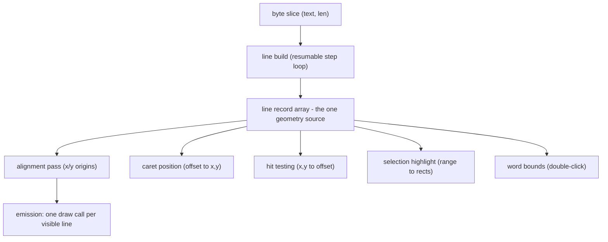
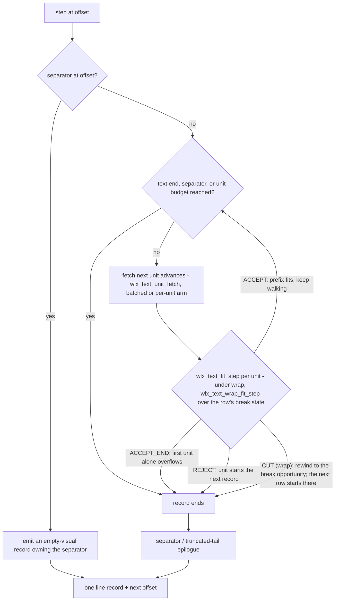
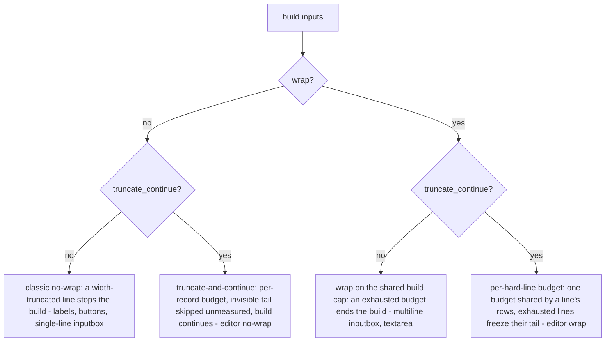
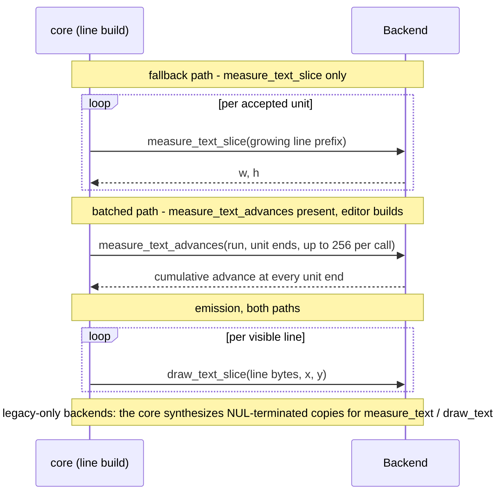

# Line Run Model

How Wollix turns a byte slice of UTF-8 text into visual lines, backend draw
calls, and caret/selection geometry. This is the conceptual guide to text
handling in `wollix.h` — read it before extending a text widget, writing a
backend, or tuning the text budgets.

Audience: application developers who want to understand what the text
widgets do with their strings, backend authors implementing the text
callbacks, and contributors working on the pipeline itself. Internal
function names are given for orientation; everything not marked `WLXDEF`
or listed in `docs/API_REFERENCE.md` is private and may change. The
editor's windowed-text model on top of this pipeline is documented in
[EDITOR_MODEL.md](EDITOR_MODEL.md). For a code-level region map of the
implementation and the invariant registry contributors must preserve,
see [TEXT_PIPELINE_MAP.md](TEXT_PIPELINE_MAP.md).

---

## Table of Contents

1. [Overview: What Is a Line Run?](#1-overview-what-is-a-line-run)
2. [Text as Byte Slices](#2-text-as-byte-slices)
3. [Text Units and UTF-8 Policy](#3-text-units-and-utf-8-policy)
4. [The Line Record](#4-the-line-record)
5. [The Line Build Pipeline](#5-the-line-build-pipeline)
6. [Newline Policy](#6-newline-policy)
7. [Wrap and No-Wrap Modes](#7-wrap-and-no-wrap-modes)
8. [Alignment and Vertical Metrics](#8-alignment-and-vertical-metrics)
9. [Emission and Clipping](#9-emission-and-clipping)
10. [One Geometry Source: The From-Lines Consumers](#10-one-geometry-source-the-from-lines-consumers)
11. [Run Budgets](#11-run-budgets)
12. [Editor Extensions: Windowed Text](#12-editor-extensions-windowed-text)
13. [Tab Expansion](#13-tab-expansion)
14. [Backend Contract](#14-backend-contract)
15. [Performance Characteristics](#15-performance-characteristics)
16. [Guarantees and Limitations](#16-guarantees-and-limitations)
17. [Configuration Reference](#17-configuration-reference)

---

## 1. Overview: What Is a Line Run?

A **line run** is the unit of text layout and rendering in Wollix: a
contiguous byte range of the source string that forms one visual line,
measured with one backend call and drawn with one backend call.

Wollix originally measured and drew fitted text one UTF-8 codepoint at a
time. That kept wrapping and cursor math simple, but it broke run-level
font behavior (kerning, pair spacing) and turned every label into dozens
of draw commands. The line run model replaced it: the core still owns all
layout decisions — line breaking, alignment, clipping, caret math — but
text reaches the backend as whole visible lines.

The pipeline has three stages, plus a family of geometry consumers that
reuse its output:



Every consumer operates on the same line records, so the caret, the
selection highlight, the hit test, and the drawn glyphs always agree —
there is exactly one line-breaking decision per frame per text.

All fitted text goes through this pipeline: `wlx_label`, `wlx_button`
captions, `wlx_inputbox` (single-line and multiline), `wlx_textarea`, and
`wlx_editor`. Only the raw helpers `wlx_draw_text` / `wlx_draw_text_slice`
bypass it (they emit one unfitted run at a fixed position).

---

## 2. Text as Byte Slices

The canonical internal text type is a byte slice:

```c
(const char *bytes, size_t len)
```

Public widget entries keep the NUL-terminated C-string surface for
convenience, but they call `strlen` exactly once at the boundary and pass
the length down. Nothing inside the pipeline ever calls `strlen` or
assumes NUL termination; a slice may be any window into a larger buffer.

`wlx_editor` takes this to its conclusion — its document is a
caller-owned buffer whose length is never derived from the bytes
([EDITOR_MODEL.md §1](EDITOR_MODEL.md#1-overview-the-editor-as-a-pipeline-consumer)).

All offsets in the model — line record fields, caret positions, selection
anchors, hit-test results — are **byte offsets** into the slice, always
kept on UTF-8 boundaries (see next section).

---

## 3. Text Units and UTF-8 Policy

The build walks the slice in **text units**. A text unit is:

- one whole UTF-8 codepoint, when the bytes at the current offset form a
  valid 2-4 byte sequence fully contained in the slice, or
- one byte, as a fallback for ASCII and malformed input.

This policy has two consequences:

1. **Malformed input cannot stall or crash layout.** Invalid bytes are
   consumed one at a time and measured as whatever the backend renders
   for them. Layout always makes forward progress.
2. **No split point ever lands inside a valid multibyte sequence.** Line
   breaks, truncation boundaries, caret offsets, and edit points are all
   normalized to unit boundaries. A public cursor offset that arrives
   mid-sequence is snapped back to the start of its codepoint.

Text units are also the currency of the run budgets (Section 11): caps
are expressed in units, not bytes, so a budget means the same thing for
ASCII and multibyte text.

The model works on codepoints, not grapheme clusters. See Section 16 for
what that implies.

---

## 4. The Line Record

The output of the build is an array of `WLX_Text_Line_Record` — one per
visual line. Each record describes four byte ranges over the source slice
plus measured geometry:

```
source text:   "alpha beta\r\nnext"
                ^          ^ ^
                |          | +-- separator_end (12)
                |          +---- visible_end = separator_start (10)
                +--------------- source_start = visible_start (0)

record 1:  source  [0, 12)   the line owns its separator bytes
           visible [0, 10)   the bytes that are measured and drawn
           separator [10, 12) the "\r\n" pair
           cursor  [0, 10]   offsets whose caret sits on this line
```

| Field group | Fields | Meaning |
|---|---|---|
| Source range | `source_start`, `source_end` | Every byte the line accounts for, separator included. Consecutive records tile the covered text with no gaps. |
| Visible range | `visible_start`, `visible_end` | The bytes measured and passed to the backend draw call. Excludes the newline separator and any invisible truncated tail. |
| Separator range | `separator_start`, `separator_end` | The newline bytes ending the line (empty if the line ended by width, budget, or end of text). |
| Cursor range | `cursor_start`, `cursor_end` | The offsets that resolve to a caret on this line. |
| Metrics | `measured_w`, `measured_h`, `advance_w`, `line_h` | Backend-measured width/height of the visible range and the uniform line advance. |
| Placement | `origin_x`, `origin_y` | Filled by the alignment pass; where the run is drawn. |
| Flags | `ended_by_newline`, `empty_visual` | Why the line ended; whether it has zero visible bytes (blank line). |

Two invariants worth internalizing:

- A caret offset maps to **exactly one** line. On a line ended by a
  newline, offsets up to (but not including) `separator_end` belong to
  it; on the last line, the end-of-text offset belongs to it too. A
  wrapped break offset belongs to the line it ends, not the one it
  starts — the caret after the last glyph of a wrapped line sits at that
  line's right edge.
- **Blank lines are real records.** A newline at the start of a scan
  produces an empty-visual record, and text ending in a newline appends a
  trailing empty record, so the caret can sit on the empty last line and
  vertical geometry counts every line.

---

## 5. The Line Build Pipeline

The build is a resumable step loop (internally `wlx_text_build_step`
driven by `wlx_text_build_lines` / `wlx_text_build_lines_from`):

```
offset = start (must be a hard line start)
while lines produced < line cap:
    step(offset) -> one line record + next offset
    stop when the step produces nothing, the cap is hit,
    or a no-wrap build truncates (stop_after_line)
```

One step produces one record by greedy fitting over **cumulative unit
advances** — the measured width of the line prefix ending at each unit:

1. If the offset sits on a newline, emit an empty-visual record owning
   that separator and continue after it.
2. Otherwise walk forward one text unit at a time, comparing each
   unit's cumulative advance against the layout rect. While the prefix
   width fits, accept the unit and keep walking.
3. Stop at the first newline, at the first unit that would overflow the
   width, or when the unit budget runs out. The first unit of a line is
   always accepted even if it alone overflows, so progress is guaranteed
   and a too-narrow rect still shows something.
4. In wrap mode the walk also carries the row's **break state**: the
   latest whitespace unit (space or tab) it accepted is the row's break
   opportunity. A non-whitespace unit that overflows cuts the row back
   to that opportunity (`CUT`), so the next row starts on the word;
   without one the row ends at the last unit that fit, inside the word.
   Whitespace that overflows is accepted anyway and hangs past the
   width; the row ends with the run (Section 7).

One step, as a flow:



Two measurement strategies fill those cumulative advances:

- **Per-unit prefix measurement** — the universal fallback and the only
  strategy on ordinary fitted text (labels, buttons, inputbox,
  textarea): after each unit, measure the whole prefix
  `[line_start, next_unit_end)` through the backend, one
  `measure_text_slice` call per unit, of growing length. It works on
  every backend, is never removed, and is parity-tested against the
  batched path.
- **Batched advances** — when the backend provides the optional
  `measure_text_advances` callback (Section 14), the editor's build and
  geometry paths send one run plus the unit-end byte offsets the core
  computed, and the backend fills the cumulative advance at every unit
  end in one call per `WLX_TEXT_ADVANCES_CHUNK` units (default 256)
  instead of one call per unit. The core keeps the unit policy
  (Section 3) and the tab-stop rounding
  ([EDITOR_MODEL.md §8](EDITOR_MODEL.md#8-tab-expansion)) on its side;
  the backend never re-derives either. Consecutive chunks of one line are
  spliced by adding the previous chunk's final advance, so shaping
  context does not carry across a chunk seam — the same documented
  approximation class as a tab stop inside a line. Non-editor paths
  keep the per-unit walk unconditionally, so the callback's presence
  cannot change any other widget's geometry.

Internally the two strategies are the two arms of one measuring fetch
entry (`wlx_text_unit_fetch`), so every measuring walk selects between
them in one place; see
[TEXT_PIPELINE_MAP.md](TEXT_PIPELINE_MAP.md) for the code-level map.

In both strategies the fit decision uses the same run-level metrics the
final draw will use — whole-prefix measures directly, or an advance
array from the same shaped pass the backend draws with. Kerning and
pair spacing inside a line are exact; there is no "sum of glyph widths"
approximation anywhere in the model.

The step is **re-entrant at hard line starts**: building from offset `k`
(where `k` is 0 or the end of a newline separator) produces exactly the
records a full build would have produced from that point. This
equivalence is a standing test contract and is what makes the editor's
windowed build
([EDITOR_MODEL.md §3](EDITOR_MODEL.md#3-build-from-offset-the-windowed-build))
possible — wrap decisions never cross a hard
newline, so a window build cannot diverge from a full build.

The line height is uniform per build: it is taken from measuring a single
space in the requested style, falling back to the font size if the
backend reports nothing.

---

## 6. Newline Policy

Three separators are recognized, each ending exactly one line:

| Bytes | Handling |
|---|---|
| `\n` | one separator |
| `\r\n` | one separator (never two lines) |
| `\r` alone | one separator |

A **hard line start** is offset 0 or the first byte after a separator.
The `\n` inside a `\r\n` pair is *not* a line start. Hard line starts are
always UTF-8 boundaries because separators are ASCII.

Everything that partitions text into lines — the build step, the editor's
line index, cursor-on-line tests — uses this same definition. The editor's
index scan and the build step are required (and tested) to agree byte for
byte over mixed LF/CRLF/UTF-8 content.

---

## 7. Wrap and No-Wrap Modes

The build has one boolean input, `wrap`, and one no-wrap refinement,
truncate-and-continue. The two flags select four regimes:



**Wrap mode** (`wrap = true`): a line that reaches the rect width breaks
at its latest **break opportunity** — after the last whitespace unit
(space or tab) that fit — and the next record continues from there, so
rows end at word boundaries. A word wider than the row breaks inside
the word, at the last unit that fit. Whitespace that overflows the width
**hangs**: it stays on the row it follows, measured past the width, so
no row after a wrap break starts with whitespace and a word that fit is
never moved to the next row. On such a row (one another row of the same
line follows) `advance_w` is the **ink extent** — the advance at the
row's last non-whitespace unit — while `measured_w` keeps the full
extent; alignment (Section 8) and the overflow scissor test read
`advance_w`. Rows ended by a separator, the text end or the unit budget
keep `advance_w == measured_w`, trailing whitespace included.
Opportunities are whitespace only: no ideographic break-anywhere class
and no hyphenation (Section 16). Used by multiline inputbox, textarea
and wrapped label content.

**No-wrap mode** (`wrap = false`): a line that reaches the rect width is
width-truncated. What happens next depends on the flavor:

- *Classic no-wrap* (labels, buttons, single-line inputbox): the build
  stops after the truncated line (`stop_after_line`). Lines that fit and
  end in newlines still stack normally, so multi-line no-wrap text works
  as long as every line fits.
- *Truncate-and-continue* (`truncate_continue = true`, editor only): the
  truncated record keeps its full source range, the invisible tail is
  skipped to the next hard line start **without measuring a single
  byte**, and the build proceeds with the next line. The per-record unit
  budget resets each line (`WLX_EDITOR_MAX_LINE_UNITS`). This is what
  lets the editor render a file where one line is a megabyte long: the
  visible prefix is measured, the tail costs a byte scan, and every other
  line is unaffected.

Setting `truncate_continue` **together with** `wrap` (the wrapped editor)
refines the wrap budget instead: the unit budget is **per hard line** —
one `WLX_EDITOR_MAX_LINE_UNITS` budget shared by a line's wrapped rows,
refreshed at every hard line start via a build-cursor counter. A line
that exhausts it freezes: its final row skips the unmeasured tail exactly
like a truncated record, and the next line starts with a fresh budget.
Without the flag, wrap keeps the shared build-wide cap (the note-scale
inputbox model, where an exhausted budget ends the build).

The tail skip normally costs a newline scan over the skipped bytes. A
caller that already knows where the line ends — the editor's line index
does — can pass the next hard line start in `known_line_next` and the
skip becomes O(1); 0 keeps the scan, and every pre-existing caller is
unchanged.

Offset math over a truncated line stays well-defined because the record's
source range covers the skipped tail; a caret inside the invisible tail
pins to the end of the visible prefix.

---

## 8. Alignment and Vertical Metrics

After the build, an alignment pass assigns each record its draw origin:

- The block of lines (`line_count * advance`) is aligned vertically
  inside the rect per the `WLX_Align` value.
- Each line is then aligned horizontally by its own `advance_w`, so
  centered multi-line text centers every line individually.

The per-line vertical advance comes from `WLX_Vertical_Metric`:

- `WLX_VMETRIC_LINE_HEIGHT` (default): the backend-reported line height.
- `WLX_VMETRIC_FONT_SIZE`: the font size (em box), which gives consistent
  cap-height placement across backends whose reported line heights differ
  (SDL3_ttf reports taller lines than Raylib's bitmap font).

Widgets expose this as the `.vertical_metric` option.

---

## 9. Emission and Clipping

Emission walks the aligned records and issues **one draw call per visible
line** that vertically intersects the rect; empty-visual lines cost
nothing. Draws go through the deferred command buffer like all other
Wollix drawing, so text layers correctly with boxes and effects.

A scissor is installed only when some line actually escapes the rect.
The clip rule differs by line count, deliberately:

- **Multi-line text clips to the rect.** Overflowing lines are cropped;
  the enclosing panel or scroll viewport scissor still bounds everything.
- **A single line is never vertically clipped by its own rect.** Fonts
  routinely render taller than the layout rect (leading, descenders,
  backend font scaling), and cropping would slice ascenders and
  descenders off perfectly reasonable labels. The clip expands vertically
  to the line's extent while keeping the horizontal bounds, so over-wide
  text still clips on the x axis.

---

## 10. One Geometry Source: The From-Lines Consumers

The same record array that emission draws from also answers every
geometry question. These "from-lines" consumers do not care whether the
array covers a whole string or a window of a huge document:

**Caret position** (offset to x,y): find the record whose cursor range
contains the offset, then measure the prefix `[visible_start, offset)` to
get the x advance. Offsets at or past `visible_end` (e.g. inside a
truncated tail) pin to the line's right edge.

**Hit testing** (x,y to offset): pick the record whose vertical band
contains y (clamped to the first/last line), then walk unit boundaries
measuring prefixes and pick the boundary nearest x by the **midpoint
rule** — clicking the left half of a glyph places the caret before it,
the right half after it. This is the exact inverse of caret positioning,
built on the same records and the same measurements, which is why
clicking where the caret is drawn always round-trips to the same offset.

**Selection highlight**: for each record intersecting the selection
range, measure the advance span of the selected prefix and fill it,
drawn before the text so glyphs sit on top.

**Word bounds** (double-click): the run of word bytes around an offset,
or the run of separators when the offset sits between words. Byte-level
scanning that is UTF-8 safe because all recognized separators are ASCII.

If you extend text behavior, keep this property: *derive geometry from
line records, never from a second, parallel line-breaking pass.*

---

## 11. Run Budgets

Every build is bounded by explicit caps — text handling never does
unbounded per-frame work because a caller passed a huge string. Budgets
are expressed in text units and visual lines:

| Budget | Default | Scope |
|---|---|---|
| `WLX_TEXT_RUN_MAX_UNITS` | 512 | Units per build for ordinary fitted text (labels, buttons, single-line inputbox). |
| `WLX_TEXT_RUN_MAX_LINES` | 128 | Line records per build on the same paths. |
| `WLX_INPUTBOX_MULTILINE_MAX_UNITS` | 4096 | Units per build for multiline inputbox / textarea geometry. |
| `WLX_INPUTBOX_MULTILINE_MAX_LINES` | 512 | Line records for the same path. |
| `WLX_EDITOR_MAX_LINE_UNITS` | 1024 | Safety cap on the units any single editor window record measures from its origin (resets every record) — not a horizontal reach limit. |

All are overridable before including `wollix.h`.

Semantics at the cap differ by widget family:

- **Freeze-at-cap** (inputbox family): content beyond the budget stays in
  the buffer but drops out of geometry. The caret pins to the end of the
  last built line and the view cannot scroll past it. This keeps the
  note-scale widgets simple and predictable; they are not document
  editors.
- **Per-record cap, never a reach limit** (editor, no-wrap): the budget
  caps how many units one window record measures, the tail of an
  over-long line is skipped without measuring, and the build always
  reaches the bottom of the viewport. A line longer than the budget is
  not frozen at it: the record re-enters the line at a measure origin
  near the view
  ([EDITOR_MODEL.md §6](EDITOR_MODEL.md#6-the-windowed-horizontal-origin)),
  so the caret, the view, and edits reach
  every byte of every line no matter its length.
- **Per-hard-line cap, freeze past it** (editor, `.wrap`): one budget is
  shared by a hard line's wrapped rows and refreshed at every hard line
  start. A line that exhausts it freezes its remaining tail out of
  geometry (there is no horizontal axis to re-enter on), and the next
  line starts with a fresh budget.

The multiline inputbox budgets exist so a tall note field can hold a few
kilobytes of prose without raising the per-run budget of every label in
the application.

---

## 12. Editor Extensions: Windowed Text

`wlx_editor` is the document-scale consumer of the pipeline, shipped in
the companion header `wollix_editor.h`. The machinery it rests on stays
in the core, where the shared pipeline and the selection draw consume
it: the line index types, the retained geometry store, and the
build-step extensions this document already covers — re-entrant builds
(Section 5), truncate-and-continue and the per-line wrap budget
(Sections 7 and 11), and `known_line_next` tail skipping.

The editor-side model — the line index, the windowed build, retained
line geometry, horizontal windowing with the windowed measure origin,
wrapped-mode rows, and the editor's tab expansion — is documented in
[EDITOR_MODEL.md](EDITOR_MODEL.md).

---


## 13. Tab Expansion

A tab advance of 0 (every non-editor path) is passthrough: the whole
prefix is measured in one backend call and a tab renders as whatever
glyph the backend gives it. Existing widgets are byte-identical to the
pre-tab-support behavior.

The editor opts in via `.tab_columns`, expanding each `\t` to the next
tab stop; the segment-splitting mechanism lives in the core prefix
measure (which is why Sections 5 and 14 reference it), and the policy
is documented in [EDITOR_MODEL.md §8](EDITOR_MODEL.md#8-tab-expansion).

---


## 14. Backend Contract

The pipeline reaches the platform through two callbacks on `WLX_Backend`:

```c
void (*measure_text_slice)(const char *text, size_t len,
                           WLX_Text_Style style, float *out_w, float *out_h);
void (*draw_text_slice)(const char *text, size_t len,
                        float x, float y, WLX_Text_Style style);
```

These are the preferred contract; all in-tree backends (Raylib, SDL3,
WASM) implement them. The legacy NUL-terminated `draw_text` /
`measure_text` remain for backwards compatibility — when only they exist,
the core synthesizes temporary NUL-terminated copies (stack buffer for
short runs, heap beyond that). New backends should implement the slice
callbacks first and can treat the legacy pair as a thin adapter.

A third, **optional** text callback batches measurement:

```c
size_t (*measure_text_advances)(const char *text, size_t len,
                                WLX_Text_Style style,
                                const size_t *unit_ends, size_t unit_count,
                                float *out_advances);
```

One call fills the cumulative advance width of the run prefixes ending
at each core-supplied `unit_ends[i]` (Section 5). The core owns the
unit policy and the tab splitting; the backend walks its own
glyph/cluster geometry and reports the advance at (or snapped to the
cluster edge after) each requested byte end. `NULL` keeps the per-unit
prefix fallback — external backends work unmodified. See
`docs/API_REFERENCE.md` for the full contract. An application that
reshapes text styles (e.g. a font-size scale) does so through
`wlx_set_style_transform`, which the core applies before every text
callback - draw, measure and advances alike - so retained geometry
cannot disagree with draw.

One line's traffic on each measurement path, and the shared emission:



What the model asks of a backend:

- **Measure and draw must agree.** The fit decision, the caret x, and the
  drawn glyphs all come from measuring the same byte ranges the draw call
  receives. A backend whose measurement diverges from its rendering will
  misplace carets and truncate lines wrongly.
- **Prefix measurement is hot on the fallback path.** Without the
  advances callback, the build measures growing prefixes of each line,
  one call per accepted text unit. Backends on that path are expected
  to make repeated measurement of recently seen runs cheap (the SDL3
  and Raylib adapters keep text caches; see ADR_012/ADR_013 in
  `docs/dev/`). With the callback, a line's geometry fills in a handful
  of chunked calls instead — and the editor retains the result, so
  steady frames stop asking entirely
  ([EDITOR_MODEL.md §4](EDITOR_MODEL.md#4-retained-line-geometry)).
- **Slices are not NUL-terminated.** A slice callback must honor `len`
  and never read past it — runs are windows into larger buffers.
- Line runs make good cache keys: a stable label produces the same
  `(bytes, len, style)` run every frame.

---

## 15. Performance Characteristics

Costs a user of the pipeline should know:

- **Draw commands scale with visible lines, not glyphs.** One deferred
  text command per non-empty visible line.
- **Build cost is measured in backend measure work.** On the per-unit
  fallback, accepting `n` units on a line issues `n` prefix-measure
  calls of growing length, so an uncached backend sees O(n^2) measured
  bytes per line; backend measure caches flatten the effective cost.
  With the advances callback, the same line fills in
  `ceil(n / WLX_TEXT_ADVANCES_CHUNK)` calls per tab segment and O(n)
  measured bytes. The budgets (Section 11) bound `n` either way.
- **The editor measures only what changed and is O(viewport).** The
  retention and windowing bounds — asserted by `make perf-editor`, not
  tendencies — are documented in
  [EDITOR_MODEL.md §9](EDITOR_MODEL.md#9-performance).
- **Idle frames are cheap.** No text is measured for widgets whose
  geometry is not being rebuilt this frame; the editor performs zero
  O(document) work on frames without an edit.

The perf instrumentation (see `docs/PERFORMANCE_DIAGNOSTICS.md`) counts
fitted builds and measured bytes per frame (`fitted_text_runs`,
`text_measured_bytes`), which is the first thing to look at when text
cost is suspect — with one caveat: the measure-call counter hooks the
public measure entry, while the line build measures through a private
helper, so build traffic is invisible to it. The authoritative
instrument is `make perf-editor`, which counts calls and bytes at the
backend boundary per frame class (cold, idle, scroll, typing, END on a
giant line) and asserts them against recorded baselines.

---

## 16. Guarantees and Limitations

Guaranteed by the model (and locked by tests):

- No split point, caret offset, or truncation boundary inside a valid
  UTF-8 sequence; malformed bytes degrade to one-byte units without
  stalling layout.
- CRLF is one separator; blank lines and a trailing newline produce real,
  caret-addressable records.
- Windowed builds reproduce full-build records exactly from any hard
  line start; editor records whose measure origin is the line start —
  every line the unit budget can cover — are identical with retention
  and the advances callback on or off (a standing parity contract).
- Caret, hit test, selection, and draw agree, because they consume the
  same records, the same retained advances, and the same measure
  origin.
- Wrapped rows end at word boundaries: after the latest space or tab
  that fit, with overflowing whitespace hanging on its row; a word wider
  than the row breaks inside it. The retained store's row table and the
  measuring scan make the same decision (the equivalence and parity
  suites run spaced prose in wrap mode).
- Kerning and run metrics are exact within a measured run: fit
  decisions use whole-run metrics (whole-prefix measures, or advance
  arrays from the same shaped pass the draw uses), never summed glyph
  widths. Shaping context does not carry across a tab stop, an
  advances chunk splice, or a windowed-origin re-entry seam — the
  documented seam classes, all confined to x-space; byte offsets are
  exact everywhere.

Not attempted (deliberately, until evidence demands more):

- **Grapheme clusters.** The unit is the codepoint. Combining marks,
  ZWJ emoji sequences, and other multi-codepoint clusters can be split by
  caret motion or wrapping. Fine for Latin-script UI text and code; not a
  full text-editing model.
- **Complex-script shaping and bidi.** Runs are passed to the backend
  as-is, left to right. Contextual shaping across a break point is not
  reconsidered, and right-to-left text is not reordered.
- **Break opportunities beyond whitespace.** Word wrap breaks after
  spaces and tabs only: no ideographic break-anywhere class (a CJK run
  on a row that holds an earlier space moves whole to the next row; a
  CJK-only line breaks per unit, which is correct for it), no hyphen or
  soft-hyphen breaks. The classifier is one function, so each class is
  an addition when evidence asks for it.
- **Per-span styling.** A build has one `WLX_Text_Style`; there is no
  rich-text run model.

These boundaries come from ADR_008 (first-pass scope), ADR_034 (editor
scope) and ADR_047 (word-wrap scope); richer typography is future ADR
territory.

---

## 17. Configuration Reference

All caps are compile-time macros, overridable before including
`wollix.h`:

```c
#define WLX_TEXT_RUN_MAX_UNITS          512   // units per ordinary fitted build
#define WLX_TEXT_RUN_MAX_LINES          128   // lines per ordinary fitted build
#define WLX_INPUTBOX_MULTILINE_MAX_UNITS 4096 // multiline inputbox geometry budget
#define WLX_INPUTBOX_MULTILINE_MAX_LINES 512
#define WLX_EDITOR_MAX_LINE_UNITS       1024  // units per editor window record (safety cap)
#define WLX_EDITOR_ORIGIN_BACKSCAN      64    // bytes scanned back for a space-edge origin
#define WLX_TEXT_ADVANCES_CHUNK         256   // units per measure_text_advances call
#define WLX_TEXT_UNDO_ENTRIES           512   // undo journal entries per text widget and direction
#define WLX_TEXT_UNDO_BYTES             262144 // undo journal bytes of removed text (same scope)
#include "wollix.h"
#include "wollix_editor.h"   // when using wlx_editor; all knobs above are core-defined
```

The editor's own header defines one further knob
(`WLX_EDITOR_OVERSCAN_LINES`) and the retained geometry store is sized
from the viewport, not a knob — both documented in
[EDITOR_MODEL.md §10](EDITOR_MODEL.md#10-configuration). The two undo
caps bound the per-widget undo journal shared by the inputbox, textarea
and editor (whole oldest steps evicted first, a single oversize step
still kept); `WLX_TEXT_UNDO_ENTRIES 0` compiles the journal out. See
[WIDGETS.md "Undo and redo"](WIDGETS.md#undo-and-redo).
