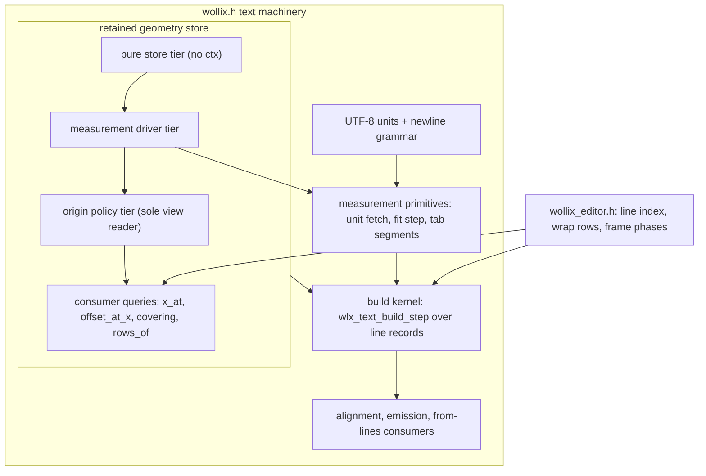
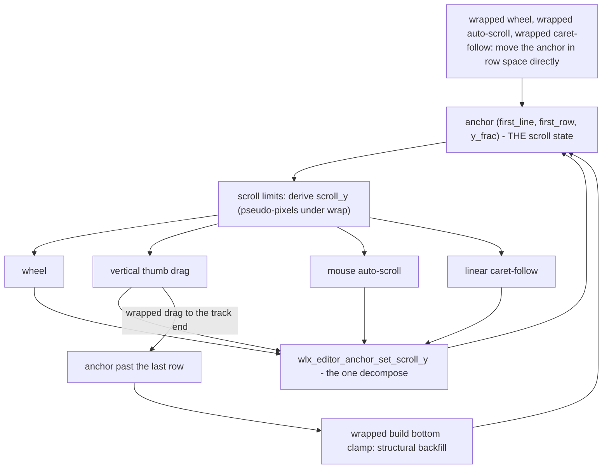

# Text Pipeline Map

A code-level orientation map of Wollix's text machinery: where each
region lives, the industry name for what it implements, the editor
frame's phase order, and the registry of invariants that bind the
regions together.

Audience: contributors reading or changing `wollix.h`'s text sections
or `wollix_editor.h`. This document maps *code*; behavior stays
canonical in [LINE_RUN_MODEL.md](LINE_RUN_MODEL.md) (the shared
pipeline) and [EDITOR_MODEL.md](EDITOR_MODEL.md) (the editor's
windowed-text model). Everything named here that is not marked
`WLXDEF` is private and may change; anchors are function names, which
survive edits better than line numbers.

---

## 1. Region Map: wollix.h

The text machinery sits in one implementation span, reading in six
regions (file order):

| Region | Key names | Role |
|---|---|---|
| UTF-8 text units and newline policy | `wlx_utf8_*` (decode/encode, word classes, the `wlx_utf8_next` order-keeping adapter), `wlx_text_unit_next` (the single stepping entry: codepoint or one-byte fallback), `wlx_text_utf8_sequence_at`, `wlx_text_newline_at` + `wlx_text_at_line_break` (forward grammar), `wlx_text_separator_before` (the one backward reading), `wlx_text_hard_line_start_at`, `wlx_text_normalize_cursor_offset` | Text-unit stepping, separator grammar (LF / CRLF / lone CR) with exactly one encoding per direction, boundary snapping |
| Budgets, policy constants, and build types | `WLX_TEXT_RUN_MAX_*`, `WLX_EDITOR_MAX_LINE_UNITS`, `WLX_TEXT_GEOM_*` constants, `WLX_Text_Line_Record`, `WLX_Text_Build_Inputs` / `_Cursor` / `_Step`, `WLX_Wrap_Row_Memo` | The record type every geometry consumer reads ("layout lines"), the build configuration struct, the work caps |
| Measurement primitives | `WLX_Text_Measure_Args` (the measurement environment, passed by const pointer), `wlx_measure_text_range`, `wlx_text_measure_prefix_tabs` / `_known`, `wlx_text_pen_has_tab` (the canonical first-tab precheck), `WLX_Text_Tab_Seg` / `wlx_text_tab_seg_next` (the shared tab-segment iterator for measure and segmented draw), `wlx_text_fit_step`, `wlx_text_wrap_ws_at` + `WLX_Text_Wrap_Break` + `wlx_text_wrap_fit_step` (the wrapped rows' word-boundary rule over the row's break state, adding the `CUT` verdict), `wlx_text_measure_advances_batch`, `wlx_text_unit_fetch` (the one measuring fetch entry: batch or per-unit arm) | Tab-aware prefix measurement, the shared fit decision and its wrap-mode layer, the batched cumulative-advance fill over the optional backend callback |
| Retained editor line geometry | `wlx_text_geom_*` family in four bannered tiers — pure store (`clear`, `env_check`, `edit_shift`, `find`, `find_containing`, `acquire`, `push_unit`, `drop`, `store_free`, the `origin_abs`/`advance_at`/`first_tab_*` reads; never touches ctx), measurement driver over the unit fetch (`extend`, `ensure_width`, `ensure_offset`, `ensure_wrap`), origin policy (`snap_origin`, `set_origin`, `window_linear`, `ensure_caret`, `avg_advance`; the sole view reader), and consumer queries (`x_at` carrying the anchored/passive policy and the far-gap bound, `offset_at_x`, `covering`, `rows_of`) plus replay (`replay_linear`, `wrap_step`) | The editor's per-hard-line cache of cumulative unit advances (plus row tables under wrap) — the "shaped-line cache"; consumers read the queries, never entry fields |
| The build kernel | `wlx_text_build_step`, `wlx_text_build_lines_from`, `wlx_text_build_lines` | The resumable greedy fitter: one step = one line record, fitting cumulative advances from one of three sources (below) |
| Alignment, emission, and from-lines consumers | `wlx_text_align_lines`, `wlx_text_emit_lines`, `wlx_text_resolve_cursor_from_lines`, `wlx_text_offset_at_point_from_lines`, `wlx_text_word_bounds`, `wlx_text_draw_selection`, the entry surface: `WLX_Text_Prepare_Opt` (options struct, zero-init = defaults), `wlx_text_prepare_lines_slice` (the one prepare core), `WLX_Text_Prepared` / `wlx_text_prepare` (stack aggregate for prepare-then-consume sites), `wlx_draw_text_fitted_slice` + the NUL adapter `wlx_draw_text_fitted`, `wlx_text_line_scratch`; `wlx_editor_line_next` sits here beside `wlx_editor_index_line_of` | Every geometry answer (caret, hit test, selection, word bounds) and every draw, all reading the same record arrays |

`wollix_editor.h` consumes all six through the companion-header
contract; its own regions are the line index, the wrap row family,
the frame-path helpers, and `wlx_editor_impl` (Section 3).

The regions and the geometry store's tiers, as a dependency sketch:

### The advance provider

The kernel's fit loop consumes **cumulative unit advances** — the
measured width of the line prefix ending at each text unit. Three
sources provide them, selected per record inside
`wlx_text_build_step`:

1. **Retained-store replay** — `wlx_text_geom_replay_linear` (no-wrap)
   or `wlx_text_geom_wrap_step` (wrap): stored floats, no backend
   traffic.
2. **Batched backend fill** — `wlx_text_measure_advances_batch` over
   the optional `measure_text_advances` callback, in
   `WLX_TEXT_ADVANCES_CHUNK` slices.
3. **Per-unit prefix measure** — `wlx_text_measure_prefix_tabs_known`,
   one growing-prefix measure per unit: the universal fallback, on
   every backend, never removed.

Sources 2 and 3 are the two arms of the one measuring fetch entry,
`wlx_text_unit_fetch(args, pos, measure_base, base_x, budget_left,
batch_allowed, ...)`, consumed by the build scan, entry extension
(`wlx_text_geom_extend`), and the wrap store build
(`wlx_text_geom_ensure_wrap`). The fetch is policy-free: a batch that
cannot progress returns 0 and each caller applies its own fail-over
(invariant 6 below). Replay (source 1) deliberately stays a separate
pre-step, not a fetch arm.

This is the same boundary mature layout stacks name the advance-array
contract; the cluster map degrades to codepoint units by documented
scope (LINE_RUN_MODEL.md section 3 and 16).

### Vocabulary crosswalk

| Industry term (systems using it) | Wollix realization |
|---|---|
| Advance provider / advance-array contract (HarfBuzz consumers, DirectWrite) | The three cumulative-advance sources selected by `wlx_text_build_step` |
| Cluster-snap rule | `measure_text_advances` contract: advance at, or snapped to the cluster edge after, each requested unit end |
| Shaped-line cache, width-independent (cosmic-text `ShapeLine`) | `WLX_Text_Geom_Entry` advances + `unit_ends` per hard line |
| Per-width layout cache (cosmic-text `LayoutLine`) | The entry's row table under wrap; validity keyed by `WLX_Text_Geom_Env` |
| Layout lines / paragraph object (PangoLayout, SkParagraph, CTLine) | The `WLX_Text_Line_Record` array of a build |
| Greedy line breaker | The fit/accept loop over `wlx_text_fit_step`; under wrap, `wlx_text_wrap_fit_step`'s last-opportunity memo cuts the row back to its latest whitespace unit |
| Break-opportunity seam (UAX #14) | `wlx_text_wrap_ws_at`, the whitespace-only opportunity class (space, tab) feeding `wlx_text_wrap_fit_step` between the advance provider and the fitter; wider classes (ideographic, hyphen) extend that one function |
| Viewport formatting over a line index (Scintilla, VS Code, TextKit2) | `WLX_Editor_Line_Index` + the editor window builds |
| Single geometry authority / hit-test pair (IDWriteTextLayout) | The from-lines consumers; hit test is the exact inverse of caret positioning over the same records |
| Model line vs view line | Hard lines (the index, the only global coordinate system) vs wrapped rows (strictly window-relative) |

### Glossary

The terms the machinery's comments use without re-explaining. Function
comments use these words verbatim; the four overloaded families are
always written in their qualified forms.

- **measured reach** — how far into a line's x-extent measurement has
  actually gone so far; the **open-reach flag** (`h_reach_open`) says a
  visible line is still width-truncated, so the horizontal scroll limit
  stays open one band past the reach.
- **measure origin** — the byte offset a retained entry measures its
  advances from (line start unless re-entered deeper); distinct from a
  record's **draw origin** (`origin_x`/`origin_y`, where it is drawn).
- **coverage (window)** — the byte/x span a retained entry's stored
  units currently answer for, from its measure origin up to its scan
  edge; distinct from the editor's **viewport window** (the visible
  lines plus overscan the frame builds records for).
- **scroll anchor** — the authoritative scroll state
  `(first_line, first_row, y_frac)`; distinct from an **anchored
  consumer**, a caller allowed to move a settled measure origin to
  reach its target, vs a **passive consumer**, which only reads
  existing coverage and never moves an origin.
- **pin** — answer with the nearest edge of existing coverage instead
  of measuring (what passive consumers do beyond coverage).
- **stitch** — carry an origin's absolute x exactly across a move by
  reading (or re-measuring) the span between old and new origin.
- **estimate** — an average-advance approximation of an x position;
  estimates are confined to x-space, byte offsets are exact always.
- **break opportunity** — the end of a wrap-whitespace unit (space or
  tab) a wrapped row may end at; the row's **break state**
  (`WLX_Text_Wrap_Break`) remembers the latest one as the **memo** the
  `CUT` verdict rewinds to.
- **hanging whitespace** — whitespace accepted past the fit width on
  the row it follows, so the next row opens on a glyph; measured, drawn
  as nothing, outside the ink extent.
- **ink extent** — a wrapped row's advance at its last non-whitespace
  unit, carried in the record's `advance_w` on rows another row
  follows; alignment and the scissor test read it, `measured_w` keeps
  the full extent.
- **budget** — an explicit cap on units measured per record, build, or
  hard line (`WLX_TEXT_RUN_MAX_UNITS`, `WLX_EDITOR_MAX_LINE_UNITS`).
- **frozen tail** — the unmeasured remainder of a line that exhausted
  its budget; still byte-addressable, out of geometry until revisited.
- **seam** — a point where shaping context does not carry across
  (tab stop, advances-chunk splice, origin re-entry); x-space only.
- **band** — the text rectangle after the gutter and scrollbar
  **strips** (the reserved gutter/bar edges) are removed.
- **replay** — answering geometry from stored floats with zero backend
  calls; its failure always falls back to measuring.
- **pseudo scroll** — wrapped mode's scroll value in hard-line pseudo
  pixels (the anchor line plus its row fraction, times `line_h`, as if
  nothing wrapped); its range ends at the **bottom anchor**, the cached
  anchor that bottom-aligns the document's last row.
- **lookahead** — the extra band width the linear window measures past
  the view so the thumb range stays ahead of the reach.
- **back margin** — the half-band the measure origin sits behind the
  view's left edge, giving wheel motion slack before re-anchoring.
- **first-tab fact** — the cached offset of the first known tab at or
  after a measured range's start; **overestimate-safe** means a stale
  or early value only costs the tab-free fast path, never correctness.
- **sticky** — monotone until explicitly reset: the **max-seen width**
  behind the horizontal thumb, and the caret's **sticky column** for
  vertical motion.
- **guard / probe** — the cheap staleness checks (length, revision,
  boundary-byte probe) that catch external document mutation.
- **traffic** — backend measure calls/bytes; "costs traffic, never
  geometry" means a cache miss re-measures but cannot change results.

**Comment convention** for the machinery's function headers (prose,
not tags — this is an ordering): first a plain *what* sentence
(operation, inputs, result, in glossary terms); then the *contract*
(returns, miss/fallback semantics, preconditions) where non-obvious;
then the *why* — the invariant or rationale; then a *see* pointer when
the full story lives in a model doc or this map's invariant registry.
Functions whose subject is ranges or axes may carry a small ASCII
sketch of their own local geometry only — flow-scale pictures live in
the model docs, and a sketch is updated in the same commit as any
change to the ranges it draws.

---

## 2. Editor Frame Phases: wlx_editor_impl

The editor frame is a fixed sequence; ordering comments at the
individual sites are authoritative — this list is the overview.

Phases 1-12 below are the staged prologue with explicit dataflow
(each stage feeds the next; the frame cannot exist earlier). After
stage 12 the fixed inputs are gathered into a read-mostly
`WLX_Editor_Frame`, and the downstream phases (13-20) take
`(frame, scroll)` — the mutable scroll transition travels beside the
frame as `WLX_Editor_Scroll` so writer sets stay visible in
signatures. The pointer-driver callbacks close over both via
`WLX_Editor_Mouse_User`. Three shared derivations:
`wlx_editor_pseudo_scroll_y` (the one wrapped pseudo-scroll formula),
`wlx_editor_anchor_set_scroll_y` (its inverse, the one scroll-to-anchor
decompose), and `WLX_Editor_Row_Iter` (the one streaming row walk over
a hard line, used by row counting, caret-row lookup, and row
hit-testing).

1. Asserts, option resolve, padding, min-height clamp.
2. Widget frame begin; persistent `WLX_Editor_State` fetch.
3. Wrap-mode-change scroll-state remap.
4. Interaction rect (starts after the previous frame's gutter width);
   interaction fetch.
5. Multi-click clock advance.
6. **Edits** (focus-gated) — before any geometry, so index, window,
   and caret see the mutated buffer; edit span captured.
7. Label/chrome; input rect (`wlx_text_field_frame`).
8. Metrics: reference space measure gives `line_h` and the tab
   advance.
9. Line index guard and rebuild; retained-geometry `edit_shift` (the
   edit-only path) or `clear` (every other rebuild cause); the cached
   wrapped bottom anchor shifts with an edit ending before its line and
   drops otherwise.
10. Band resolve (`wlx_editor_resolve_band`): gutter, scrollbar
    strips, pre-strip window band height.
11. Retained-geometry environment check and store sizing; an
    environment change also drops the cached bottom anchor.
12. Wrap inputs at the final band width; anchor clamp against the
    current index; anchor row count.
13. Scroll limits (`wlx_editor_scroll_limits`): derives the
    frame-local `scroll_y` from the anchor, the max scrolls (wrapped:
    the range ends at the bottom anchor's pseudo scroll,
    `wlx_editor_wrap_bottom_anchor` filling the cache on a miss), and
    the horizontal thumb content width; a linear clamp change
    normalizes the anchor through `wlx_editor_anchor_set_scroll_y`.
14. Scroll resolve (`wlx_editor_scroll_resolve`): wheel and thumb
    gestures — each vertical gesture decomposes its scroll into the
    anchor at its own site (a wrapped drag to the track end anchors
    past the last row for the build's structural backfill instead).
15. Caret and selection input (`wlx_editor_caret_input` with the
    mouse callbacks); mouse auto-scroll decomposes at its site.
16. Caret-follow (wrapped, gated off during a thumb drag; or linear,
    decomposing at its site).
17. Document-rebuilt reach release (`max_line_w`, `h_reach_open`).
18. Window build (wrapped or linear) — produces the frame's records;
    the wrapped build's bottom clamp may rewrite the anchor and the
    final `scroll_y` (the one sanctioned mid-build write).
19. Selection draw, text draw, gutter draw.
20. Carets and scrollbars (`wlx_editor_draw_carets_and_bars`).
21. Epilogue: widget frame end.

The anchor is the only authoritative scroll state: `scroll_y` is a
derived view, and every writer that moves it re-derives the anchor
immediately via `wlx_editor_anchor_set_scroll_y` (the inverse of the
derive; there is no end-of-frame write-back). As a dataflow:

### Writer/reader summary for the shared frame values

Summary only — the site-local comments carry the full rationale.

| Value | Written by (phase) | Read by |
|---|---|---|
| `scroll_y` (derived view of the anchor; pseudo-pixels under wrap) | Derived in scroll limits (13); wheel/thumb (14); mouse auto-scroll (15); linear caret-follow (16); wrapped window build's bottom clamp (18) — every writer decomposes into the anchor at its site | Caret input (15), caret-follow (16), window builds (18), carets and bars (20) |
| Anchor `(first_line, first_row, y_frac)` (persistent, THE authoritative scroll state) | Wrap-toggle remap (3); anchor clamp (12); limits clamp normalization (13); gesture-site decomposes (14-16); wrapped caret-follow (16); wrapped build bottom clamp (18) | Scroll limits (13), wrap hit/auto-scroll (15), window builds (18), gutter (19) |
| `h_reach_open` (persistent, cross-frame) | Both window builds (18); rebuilt-document release (17) | Next frame: band resolve (10, bar visibility), scroll limits (13, open reach limit) |
| `max_line_w` (persistent, monotone per document generation) | Grown by the linear window build (18); zeroed by the rebuilt-document release (17) | Band resolve (10), scroll limits (13), carets and bars (20, thumb range) |
| Wrapped bottom anchor cache (persistent, end-relative) | Filled on a miss by scroll limits (13) or the wrapped build's bottom clamp (18); shifted or dropped by the index rebuild (9); dropped by the environment check (11) | Scroll limits (13, thumb range end), wrapped build bottom clamp (18) |

---

## 3. Invariant Registry

The properties a change to these regions must preserve. "Locked by"
names the instrument that catches a violation; an invariant whose
instrument is listed as *discipline* has no automated tripwire and
deserves extra review care.

1. **Replay equals scan.** The store walks
   (`wlx_text_geom_replay_linear`, `wlx_text_geom_ensure_wrap` /
   `wrap_step`) and the measuring scans in `wlx_text_build_step` must
   make identical fit decisions: same `wlx_text_fit_step`, same wrap
   rule (`wlx_text_wrap_fit_step` over the row's break state, and the
   same ink extent read back from the kept units), same budget caps,
   same first-unit-always-accepted rule. Locked by the geom-cache
   equivalence suite (including its spaced-prose case), the
   advances-parity frame streams, and `WLX_DEBUG` cross-asserts.
2. **One geometry source.** Caret, hit test, selection, word bounds,
   and draw all derive from the same record array — never a second
   line-breaking pass (LINE_RUN_MODEL.md section 10). Locked by the
   caret/hit round-trip suites.
3. **Re-entrancy at hard line starts.** A build entered at any hard
   line start reproduces the tail of a full build byte-for-byte.
   Locked by record `memcmp` parity in the editor pipeline suite.
4. **The semantic batch gate.** Batched advances are used only under
   truncate-and-continue with a live context (`wlx_text_build_step`'s
   `batch_rec` gate feeding `wlx_text_unit_fetch`); non-editor widgets
   stay on the per-unit path regardless of backend capability, keeping
   them byte-identical on advances-capable backends. Locked by the
   never-batch pin (advances-callback call counting) in the editor
   pipeline suite.
5. **The heights split.** Batch fills carry the uniform `line_h` as
   the record's measured height; per-unit fills carry the
   backend-measured height. Never unify silently — it is an explicit
   property of `wlx_text_unit_fetch`'s output. Locked by the
   heights-split pin (content-dependent-height mock) in the editor
   pipeline suite.
6. **Fetch fail-over is caller policy.** A batch fill returning zero
   units is handled three deliberately different ways: the build
   step's sticky per-record fallback, `wlx_text_geom_extend`'s
   retry-per-call, `wlx_text_geom_ensure_wrap`'s
   abort-to-measuring-build. The policies live at the call sites, not
   in the fill. Locked by exact-count traffic baselines.
7. **First-tab overestimate safety.** `line_first_tab` /
   `first_tab_rel` may claim a tab earlier than the truth (including
   the zero init); an overestimate only costs the fast path, never
   correctness, and the fact resets at hard line starts. Preserved by
   the tab corpora in the parity and edit suites.
8. **Origin non-oscillation.** In `wlx_text_geom_window_linear`, the
   advance rule never anchors right of the view's left edge —
   otherwise the retreat rule pulls the origin back next frame and
   the two rules trade a full re-measure every frame. Locked by the
   windowed-origin hold/no-thrash assertions and the perf gate's
   steady-frame bounds.
9. **The stitch precondition.** `wlx_text_geom_set_origin`'s stitch
   arms are valid only when the old origin lies within one unit
   budget of the new one; the guarantee is established by the
   callers (`window_linear`, `ensure_caret`). Locked by the
   windowed-origin exactness sweeps under the additive mock.
10. **Byte offsets exact everywhere.** All approximations are
    confined to x-space (the far-jump origin estimate, the scrollbar
    ranges); a caret or edit offset is never approximate. Locked
    across the editor suites; an ADR guardrail.
11. **The per-unit fallback is permanent.** `measure_text_advances`
    is optional; the prefix-measure path serves every backend and is
    never deleted. An ADR guardrail.
12. **Miss falls back to measuring, everywhere.** Every retained-
    geometry consumer keeps the from-scratch path; a dropped or
    evicted entry costs traffic, never geometry. Locked by the
    eviction and invalidation suites.
13. **Scratch is a single-borrower loan.** `wlx_text_line_scratch`
    has no ownership tracking; two overlapping borrowers corrupt
    records silently. Locked by: *discipline*.
14. **Anchor outcomes are the contract.** The anchor triplet is the
    one authoritative scroll state; every gesture decomposes its
    scroll motion into the anchor at its own site
    (`wlx_editor_anchor_set_scroll_y`), and the wrapped window
    build's bottom clamp is the one sanctioned mid-build anchor
    write. The decomposition plumbing is implementation, free to
    change while the pinned anchor values hold. Locked by the view
    and wrap suites' exact anchor assertions.
15. **Pre-strip sizing.** The set of lines the window considers
    depends only on the scroll position, never on which scrollbars
    are visible (window band height and the wrap overflow probe use
    pre-strip geometry), preventing bar-visibility feedback. Locked
    by the bar-stability tests in the view suite.

---

## 4. Where Behavior Is Specified

- Pipeline behavior, budgets, backend contract:
  [LINE_RUN_MODEL.md](LINE_RUN_MODEL.md)
- Editor model (index, windowed build, retention, windowed origin,
  wrapped rows, tabs): [EDITOR_MODEL.md](EDITOR_MODEL.md)
- Widget API surface: [WIDGETS.md](WIDGETS.md),
  [API_REFERENCE.md](API_REFERENCE.md)
- Performance instruments: [PERFORMANCE_DIAGNOSTICS.md](PERFORMANCE_DIAGNOSTICS.md)
  and the `make perf-editor` gate.
