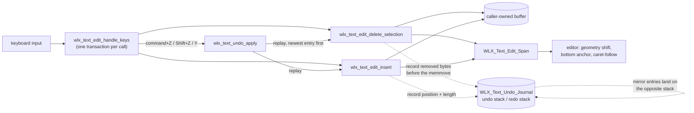
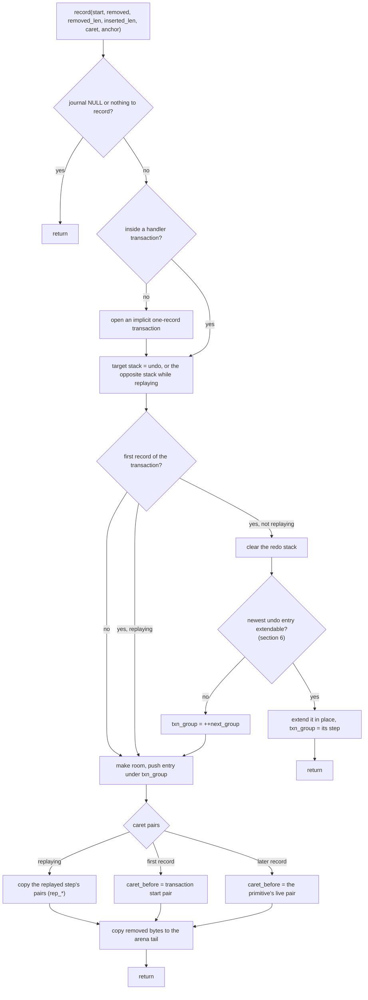
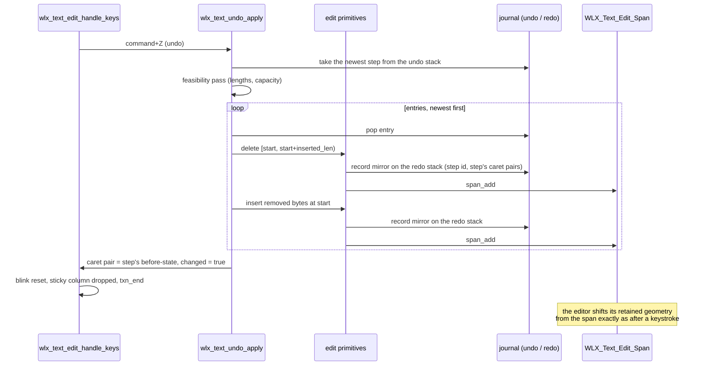
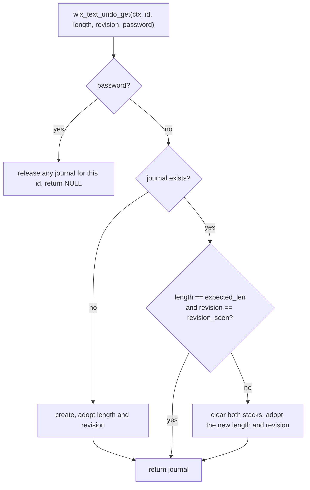

# Undo Model

> **Companion to [WIDGETS.md "Undo and redo"](WIDGETS.md#undo-and-redo)
> and [EDITOR_MODEL.md](EDITOR_MODEL.md).** The user-facing rules (which
> chords, what coalesces, the caps) live in WIDGETS.md and stay canonical;
> this document covers the machinery behind them: the text undo journal
> inside `wollix.h`, what it stores, how edits are recorded, how steps
> form, how undo and redo replay, and where the bounds and guards sit.

How every text widget in Wollix (inputbox, textarea, editor) gets undo
and redo from one mechanism: a per-widget journal that the two shared edit
primitives record into, and that the undo chords replay through those same
primitives. Read it before touching the key handler, the edit primitives,
the editor's line-index guard, or anything that keeps per-widget history.

Audience: contributors working on the text widgets, and application
developers who want to know exactly what `command+Z` will and will not do
to their buffer. Everything named here that is not marked `WLXDEF` is
private and may change; the public surface is summarised in
[section 11](#11-public-surface).

---

## Table of Contents

1. [Overview: One Journal, Three Widgets](#1-overview-one-journal-three-widgets)
2. [Where the Journal Lives](#2-where-the-journal-lives)
3. [Data Model](#3-data-model)
4. [Recording: The Two Primitives](#4-recording-the-two-primitives)
5. [Transactions and Steps](#5-transactions-and-steps)
6. [Coalescing Runs](#6-coalescing-runs)
7. [Undo and Redo: Replay](#7-undo-and-redo-replay)
8. [Bounds and Eviction](#8-bounds-and-eviction)
9. [The Staleness Guard](#9-the-staleness-guard)
10. [Widget Integration](#10-widget-integration)
11. [Public Surface](#11-public-surface)
12. [Internal API Reference](#12-internal-api-reference)
13. [Costs](#13-costs)
14. [Tests](#14-tests)
15. [Limits and Future Work](#15-limits-and-future-work)

---

## 1. Overview: One Journal, Three Widgets

Wollix has exactly two functions that write into a text buffer:
`wlx_text_edit_delete_selection` and `wlx_text_edit_insert`. Every path of
the shared key vocabulary (typing, Enter, Tab, Backspace and Delete with
their word variants, cut, paste) goes through them, and every text widget
(inputbox, textarea, editor) reaches that vocabulary through one function,
`wlx_text_edit_handle_keys`. The undo journal hooks the two primitives, so
it sees every mutation of every widget without a single widget-specific
recording site.

The journal stores, per widget, an ordered history of *exact contiguous
replaces*: "the bytes `removed` at `start` were replaced by `inserted_len`
bytes". Undo replays the newest step backwards through the same two
primitives (delete what was inserted, insert what was removed), which has
two consequences that shape the whole design:

- **Redo is free.** The replay's own recording, routed to the opposite
  stack, is the mirror step. Nothing is ever stored for an insert beyond
  its position and length: when it is undone, the delete that undoes it
  keeps the bytes for redo.
- **Everything downstream sees an ordinary edit.** The frame's edit span
  (`WLX_Text_Edit_Span`) is produced exactly as for a keystroke, so the
  editor's retained geometry shift, its wrapped bottom anchor and its
  caret-follow work unchanged, and the widgets report "text changed this
  frame" as usual.



What "byte-exact" means here: after an undo the buffer holds the same bytes
it held before the step, the caret and the selection anchor are the pair
the user had before the step, and the document length agrees; redo returns
to the bytes and the caret pair the step left behind. No timers, no
snapshots, no diffing.

---

## 2. Where the Journal Lives

Journals are context-owned, keyed by widget id, and found by a linear scan
of a small cache, the same shape as the editor's line-index cache:

```
WLX_Context
  |
  +-- text_undo : WLX_Text_Undo_Cache
        |
        +-- items[0] : WLX_Text_Undo_Journal   id = inputbox #1
        |               +-- undo : WLX_Text_Undo_Stack (entries[], arena)
        |               +-- redo : WLX_Text_Undo_Stack (entries[], arena)
        +-- items[1] : WLX_Text_Undo_Journal   id = editor
        +-- ...
```

The widget id is the persistent state id (`wlx_get_state_impl`), so a
journal follows the same identity rules as any per-widget state: the call
site plus the id stack, or an explicit `.id`.

Lookup happens in one place per widget, inside its *focused* branch, right
before the key handler runs: `wlx_text_undo_get(ctx, id, length,
revision, password)`. That placement carries three guarantees:

- An unfocused field never touches the cache. Idle frames of a focused
  field pay one scan of the cache (a handful of pointer compares) and
  nothing else.
- A journal is created on the first focused frame, but its arrays are
  allocated on the first *mutation*; a field that is focused and never
  edited costs one 200-byte cache item.
- The staleness guard (section 9) runs at lookup, before any chord could
  replay stale history.

A NULL journal means "no history" and is a first-class state, handled by
every entry point without branching at the call sites:

| Situation | Journal pointer |
|---|---|
| `WLX_TEXT_UNDO_ENTRIES` defined as `0` | NULL (the whole implementation compiles to inline no-ops) |
| `.password` field | NULL; any journal the id already had is released, so plaintext never lingers |
| Allocation failure while creating the cache item | NULL for this frame |
| Unfocused widget | the handler does not run, so no lookup |

The cache is freed by a typed sweep in `wlx_context_destroy`, next to the
line-index sweep. Each item carries a `touch` stamp (the cache clock at
its last lookup) so a future state-eviction pass can prune journals of
widgets that stopped appearing; nothing evicts whole journals today.

---

## 3. Data Model

Five types, all in `wollix.h`, all private.

### 3.1 `WLX_Text_Undo_Class`

The class names the handler path that produced a record. It decides which
steps may coalesce (section 6) and marks replayed entries.

| Value | Set by | Coalesces? |
|---|---|---|
| `WLX_TEXT_UNDO_CLS_NONE` | transaction start, before any path ran | - |
| `WLX_TEXT_UNDO_CLS_TYPING` | text-input inserts (and the selection delete that precedes them) | yes: consecutive inserts at the run's end |
| `WLX_TEXT_UNDO_CLS_BACKSPACE` | unit (grapheme cluster) Backspace | yes: consecutive deletes ending at the run's start |
| `WLX_TEXT_UNDO_CLS_DELETE` | unit (grapheme cluster) forward Delete | yes: consecutive deletes at the run's start |
| `WLX_TEXT_UNDO_CLS_SELECTION` | Backspace or Delete on a live selection | no |
| `WLX_TEXT_UNDO_CLS_WORD_DELETE` | Ctrl/Alt+Backspace, Ctrl/Alt+Delete | no |
| `WLX_TEXT_UNDO_CLS_NEWLINE` | Enter | no |
| `WLX_TEXT_UNDO_CLS_TAB` | Tab (editor) | no |
| `WLX_TEXT_UNDO_CLS_PASTE` | command+V | no |
| `WLX_TEXT_UNDO_CLS_CUT` | command+X | no |
| `WLX_TEXT_UNDO_CLS_REPLAY` | recorded while an undo or redo replays | no, and it ends any run |

### 3.2 `WLX_Text_Undo_Entry` (72 bytes)

One entry is one exact contiguous replace.

```c
typedef struct {
    uint32_t group;        // step id; entries with equal ids revert together
    uint8_t  cls;          // WLX_Text_Undo_Class of the recording path
    size_t   start;        // byte offset of the replaced range
    size_t   removed_len;  // original bytes removed, stored in the arena
    size_t   inserted_len; // bytes inserted at start, live in the document
    size_t   arena_off;    // where the removed bytes sit in the arena
    size_t   caret_before, anchor_before;   // caret pair before the edit
    size_t   caret_after,  anchor_after;    // caret pair after the edit
} WLX_Text_Undo_Entry;
```

Reading: "at `start`, the `removed_len` original bytes (found at
`arena + arena_off`) were replaced by the `inserted_len` bytes now in the
document at `start`". Two invariants make this enough to invert any
sequence:

- **LIFO validity.** An entry's coordinates are valid at the moment it is
  reverted, because every newer entry has been reverted first. Nothing
  ever needs to remap offsets.
- **Inserted bytes are never stored.** Reverting an insert is a delete,
  and that delete's own recording captures the bytes (onto the redo stack).
  An insert record therefore costs no arena space until it is undone.

The caret pairs are `(cursor_pos, selection_anchor)` from
`WLX_Text_Edit_State`. `caret_before` of the *oldest* entry of a step is
what undo restores; `caret_after` of the *newest* is what redo restores.

### 3.3 `WLX_Text_Undo_Stack` (48 bytes)

One direction's history: entries in push order plus a byte arena holding
their removed bytes in the same order.

```c
typedef struct {
    WLX_Text_Undo_Entry *entries;
    size_t count;        // entries in use
    size_t cap;          // allocated entries
    char *arena;
    size_t arena_used;   // bytes in use
    size_t arena_cap;    // allocated bytes
} WLX_Text_Undo_Stack;
```

Arena invariants, checked by the test suite after every scenario:
entries' arena runs are laid out in entry order, contiguous from offset 0,
and `arena_used` is the sum of every `removed_len`. So the newest entry's
run always *ends* the arena, which is what makes a pop O(1) and lets the
newest entry grow at either end when a run coalesces.

A worked example. Document `hello`, the user selects `lo` (caret 3,
anchor 5) and types `X`, then `Y`:

```
document:  "hello"  ->  "heX"  ->  "heXY"

undo stack after "Y":
  entries  [0] group 7  TYPING  start 3  removed 2  inserted 0  arena_off 0
               caret_before (3,5)  caret_after (3,3)        <- the selection delete
           [1] group 7  TYPING  start 3  removed 0  inserted 2  arena_off 2
               caret_before (3,3)  caret_after (5,5)        <- "X", extended by "Y"
  arena    | l | o |
           0       2 = arena_used
redo stack: empty
```

Both entries share group 7, so one `command+Z` reverts both: it deletes
`XY` at 3, inserts `lo` at 3, and restores caret pair `(3,5)`, the original
selection.

### 3.4 `WLX_Text_Undo_Journal` (200 bytes)

```c
typedef struct {
    size_t   id;              // widget id
    uint32_t touch;           // cache clock at the last lookup
    WLX_Text_Undo_Stack undo;
    WLX_Text_Undo_Stack redo;
    uint32_t next_group;      // last step id handed out

    // staleness guard (section 9)
    size_t   expected_len;    // document length after the last recorded or replayed mutation
    uint32_t revision_seen;   // caller revision seen with it
    bool     guard_seen;      // false until the first lookup adopted length/revision

    // transaction (section 5)
    bool     in_txn;          // inside one key-handler invocation
    bool     replaying;       // an apply is running: records go to the opposite stack
    bool     txn_first;       // the next record is the transaction's first
    bool     last_was_replay; // the newest transaction was an undo/redo: no coalescing into it
    uint8_t  cls;             // class the current handler path declared
    uint32_t txn_group;       // step id records in this transaction carry
    size_t   txn_caret0, txn_anchor0;   // caret pair at transaction start
    bool     alloc_failed;    // a record could not be kept; the step is void

    // replay (section 7)
    bool     replay_redo;     // true while applying a redo (mirror goes to the undo stack)
    size_t   rep_caret_before, rep_anchor_before;   // the replayed step's caret pairs,
    size_t   rep_caret_after,  rep_anchor_after;    // stamped onto its mirror entries
} WLX_Text_Undo_Journal;
```

### 3.5 `WLX_Text_Undo_Cache`

```c
typedef struct {
    WLX_Text_Undo_Journal *items;
    size_t count, capacity;
    uint32_t clock;           // advanced on every lookup; stamps `touch`
} WLX_Text_Undo_Cache;
```

---

## 4. Recording: The Two Primitives

Both primitives take the journal as their last parameter (NULL means no
history) and call two hooks: `wlx_text_undo_record` *before* the bytes
move, and `wlx_text_undo_note_caret_after` once the caret and length are
final.

```
wlx_text_edit_delete_selection(buffer, length, cursor, anchor, span, undo)
    sel_min, sel_max from the caret pair; nothing to do if equal
    record(undo, sel_min, &buffer[sel_min], sel_max - sel_min, 0, *cursor, *anchor)
    memmove: close the gap                     <- the removed bytes are gone after this
    *length -= n; caret = anchor = sel_min
    span_add(span, sel_min, sel_max, sel_min)
    note_caret_after(undo, *cursor, *anchor, *length)

wlx_text_edit_insert(buffer, buffer_cap, length, cursor, anchor, text, len, span, undo)
    ins = len clipped to the capacity and backed off to a UTF-8 boundary; nothing to do if 0
    record(undo, *cursor, NULL, 0, ins, *cursor, *anchor)
    memmove: open the gap; memcpy the bytes
    span_add(span, *cursor, *cursor, *cursor + ins)
    caret = anchor = *cursor + ins; *length += ins
    note_caret_after(undo, *cursor, *anchor, *length)
```

`record` is the only writer of entries and arena bytes. Its decision tree:



Three details worth knowing:

- **The transaction start pair is the before-state.** A Backspace parks
  the anchor at the previous unit (a grapheme cluster, possibly many
  bytes) and deletes the range, so the primitive's own caret pair at that
  moment is a one-unit selection.
  The record uses the pair the transaction started from instead, and undo
  restores a collapsed caret, not a phantom selection. Later records in the
  same transaction (the insert after a selection delete) use the live pair,
  which is exactly the state between the two primitives.
- **`note_caret_after` closes the record** with the pair the primitive
  left behind and the new document length. During a replay it leaves the
  mirror entries' pairs alone (they carry the step's own) and only updates
  the length.
- **Allocation failure voids the step.** If the arrays cannot grow, both
  stacks are reset and `alloc_failed` is raised; an apply in progress
  stops and drops the history rather than leaving a gap.

---

## 5. Transactions and Steps

A *step* is what one `command+Z` reverts: every entry sharing a `group`
id. Steps are formed by *transactions*: one invocation of
`wlx_text_edit_handle_keys` is one transaction, opened after the handler
clamps the caret pair and closed before it returns.

```
wlx_text_edit_handle_keys(ctx, st, buffer, buffer_cap, length, caps, span, undo)
    clamp caret pair to *length
    txn_begin(undo, caret, anchor)        <- snapshot the before-state, class = NONE
    command modifier block:
        undo/redo chords (section 7)      <- first, so a chord frame never also pastes
        copy; cut [CUT]; paste [PASTE]; select-all
    typing            [TYPING]
    Enter             [NEWLINE]
    Tab               [TAB]
    Backspace         [SELECTION | WORD_DELETE | BACKSPACE]
    Delete            [SELECTION | WORD_DELETE | DELETE]
    LEFT / RIGHT
    normalise caret pair, blink reset, sticky-column drop
    txn_end(undo, *length)                <- expected_len = the length any later frame must find
```

Each bracketed path calls `wlx_text_undo_set_class` before its primitive
calls. The class is per path, not per key: Backspace on a live selection
is `SELECTION`, a word delete is `WORD_DELETE`, and only the plain
unit delete is `BACKSPACE`.

Every primitive call inside a transaction records under the transaction's
`txn_group`, so a frame that runs two primitives makes a two-entry step:

| Frame | Primitive calls | Entries | One step? |
|---|---|---|---|
| type `a` | insert | 1 | yes |
| type `a` over a selection | delete, insert | 2 | yes |
| paste over a selection | delete, insert | 2 | yes |
| Enter over a selection | delete, insert | 2 | yes |
| cut | delete | 1 | yes |
| Backspace on a selection | delete | 1 | yes |
| Backspace on a unit (cluster) | delete (anchor parked) | 1 | yes |
| undo of a two-entry step | delete + insert per entry | 2 to 4 mirror entries | yes (same id) |

The `group` id comes from `next_group`, a per-journal counter that only
ever increases; a replayed step keeps its original id on both stacks.

Outside a transaction the primitives still work: `record` opens an
implicit one-record transaction. Nothing in Wollix relies on it (the
handler always opens one), but a NULL-safe primitive should not depend on
its caller's ceremony.

---

## 6. Coalescing Runs

Typing a word and then pressing `command+Z` should remove the word, not
the last letter. The journal achieves that without timers: the first
record of a transaction may *extend the newest undo entry in place*
instead of opening a new step. `wlx_text_undo_coalesce_target` decides,
and all of the following must hold:

1. **No replay since that entry.** `last_was_replay` is false. After an
   undo or redo the next edit always opens a new step, even if the caret
   sits exactly where the redone run ended.
2. **Same class, and a run class.** The record's class equals the newest
   entry's class and is `TYPING`, `BACKSPACE` or `DELETE`.
3. **Caret continuity.** The caret pair the transaction started from
   equals the pair the newest entry left behind (`caret_after`,
   `anchor_after`). An arrow key, a click that moves the caret, or a
   selection in between breaks it; a click that lands exactly where the run
   ended does not.
4. **Adjacency on the growing side.**
   - `TYPING`: a pure insert exactly at `start + inserted_len` of the entry.
   - `BACKSPACE`: a pure delete whose range *ends* at the entry's `start`,
     on an entry that inserted nothing.
   - `DELETE`: a pure delete whose range *starts* at the entry's `start`,
     on an entry that inserted nothing.
5. **Under the run bound.** The entry holds fewer than
   `WLX_TEXT_UNDO_GROUP_BYTES` (4096, internal) bytes of removed plus
   inserted text. Past it the next keystroke opens a new step, so one undo
   never swallows an unbounded run and the in-place growth stays cheap.

Whatever the outcome, the first record of a non-replay transaction clears
the redo stack: a new edit after an undo forgets the undone future.

How the entry grows in each case:

```
TYPING     entry.inserted_len += n                  (no arena traffic)

DELETE     arena: | ...older runs... | run |  ->  | ...older runs... | run | new |
           entry.removed_len += n                   (bytes appended at the tail)

BACKSPACE  arena: | ...older runs... | run |  ->  | ...older runs... | new | run |
           entry.start -= n; entry.removed_len += n
           (the run is the arena tail, so it is moved up by n and the new
            bytes are written in front of it: a memmove bounded by the run
            length, itself bounded by WLX_TEXT_UNDO_GROUP_BYTES)
```

A Backspace run over `e-acute, euro, a` (2 + 3 + 1 bytes) therefore ends
as one entry `start 0, removed 6` whose arena run reads exactly the
original six bytes in document order, and undo re-inserts them in one
primitive call.

What starts a new step, in user terms:

| Between two keystrokes | Coalesces? | Why |
|---|---|---|
| nothing (same run kind) | yes | rules 2 to 5 |
| an arrow key, Home/End, PageUp/PageDown | no | continuity (rule 3) |
| a click elsewhere, a drag | no | continuity |
| a click on the caret position | yes | continuity holds |
| Backspace after typing (or the reverse) | no | class (rule 2) |
| Enter, Tab, paste, cut, word delete, selection delete | no | single-step classes |
| typing over a selection | no | the delete is not a pure insert (rule 4) |
| an undo or redo | no | rule 1 |
| 4096 bytes accumulated | no | rule 5 |

---

## 7. Undo and Redo: Replay

### 7.1 The chords

At the top of the handler's command-modifier block (before copy, cut and
paste, so a chord frame is never also a paste frame in an ambiguous
order), when the journal is non-NULL and the field is not read-only:

| Chord | Action |
|---|---|
| command+Z | `wlx_text_undo_apply(undo, redo = shift)` : undo, or redo when Shift is held |
| command+Y | `wlx_text_undo_apply(undo, redo = true)` |

Both use `wlx_is_key_actuated`, so a held chord keeps stepping at the OS
repeat rate, like Backspace. The command modifier is Cmd on Apple
platforms and Ctrl elsewhere, as for the clipboard chords. A read-only
field rejects the chords like any other mutation and keeps its journal.

### 7.2 `wlx_text_undo_apply`

```
apply(j, redo, st, buffer, buffer_cap, length, span)
  1. src = redo ? j->redo : j->undo; empty -> return false (nothing changed)
  2. step = the trailing entries of src sharing the newest group id
  3. feasibility, newest to oldest, on a simulated length:
         require start <= len and inserted_len <= len - start
         len = len - inserted_len + removed_len
         require len <= buffer_cap
     any failure: clear both stacks, return false (the buffer changed under the journal)
  4. stamp the step's caret pairs into rep_*; replaying = true; replay_redo = redo;
     txn_group = the step id; cls = REPLAY
  5. for each entry, newest first:
         pop it (count--, arena_used -= removed_len; its bytes stay in place)
         if inserted_len > 0: caret = start, anchor = start + inserted_len;
             delete_selection(...)          -> records a mirror entry on the other stack
         if removed_len > 0: caret = anchor = start;
             insert(arena + arena_off, removed_len)   -> records a mirror entry
         a primitive that could not do exactly its job voids the step: clear, return
  6. replaying = false; txn_first = true (a later record in this frame starts its own step)
     caret pair = rep before-pair (undo) or after-pair (redo)
     last_was_replay = true; return true
```

Pop-first is safe because nothing writes the source stack during the
replay: the mirror recording goes to the other stack's arrays, and the
popped entry's bytes remain in the source arena until the insert has read
them. The feasibility pass makes the step all-or-nothing: no byte moves
unless every entry can be applied exactly.



### 7.3 Mirror entries and the caret pairs

The mirror entries are recorded by the primitives while `replaying` is
set, so `record` routes them to the opposite stack under the replayed
step's id. Their caret pairs are *not* the primitives' working carets
(which point at replay positions) but the step's own pairs, stamped from
`rep_*`: the oldest entry's before-pair and the newest entry's after-pair.
That is what lets redo restore the caret the user had after typing, and a
second undo restore the caret they had before it, indefinitely.

Continuing the section 3 example:

```
before undo   undo: [d(3,"lo"), i(3,2)]  group 7        redo: []
after undo    undo: []                                   redo: [d(3,"XY")  group 7, i(3,2) group 7]
              document "hello", caret (3,5)
after redo    undo: [d(3,"lo") group 7, i(3,2) group 7]  redo: []
              document "heXY", caret (5,5)
```

A mixed entry (removed and inserted bytes) mirrors as two entries; pure
entries mirror as one; after the first undo the count is stable. The entry
cap admits an oversize step, so a step never fails to mirror for want of
entry slots.

### 7.4 Replay ends coalescing

After an apply, `last_was_replay` is true and `txn_first` is reset. The
next recorded edit opens a new step even if it would otherwise extend the
newest entry: the entry beneath a just-undone step is an older run the
user did not intend to continue. Any non-replay record then sets
`last_was_replay` back to false.

---

## 8. Bounds and Eviction

Two `#ifndef`-guarded caps, documented in the configuration block at the
top of `wollix.h`, apply per widget and per direction:

| Macro | Default | Meaning |
|---|---|---|
| `WLX_TEXT_UNDO_ENTRIES` | 512 | entries retained per stack; `0` compiles the journal out |
| `WLX_TEXT_UNDO_BYTES` | 262144 | bytes of removed text retained per stack |
| `WLX_TEXT_UNDO_GROUP_BYTES` | 4096 (internal, not a config macro) | run bound for coalescing |

A value of `WLX_TEXT_UNDO_ENTRIES` between 1 and 7 is a compile-time
error; at 0 every entry point becomes an inline no-op and the context's
cache stays empty.

`wlx_text_undo_make_room(stack, need_bytes, current_group)` runs before
every push and every in-place extension:

```
while the stack has entries
      and its oldest entry's step is not current_group
      and (count >= WLX_TEXT_UNDO_ENTRIES or arena_used + need_bytes > WLX_TEXT_UNDO_BYTES):
    evict the oldest step whole: drop its entries, memmove the remaining
    entries and arena bytes down, subtract the freed bytes from every
    surviving arena_off
grow the entry array if full   (16, doubling, capped at the entry cap;
                                past the cap only when the current step alone fills it)
grow the arena if needed       (256 bytes, doubling, capped at the byte cap;
                                a need beyond the cap is allocated exactly)
```

Consequences:

- **Whole steps only.** A step is never split by eviction; the user
  either has the whole undo or none of it.
- **Oversize steps are admitted.** Select-all followed by Delete on a
  300 KB document records one 300 KB entry: it evicts everything older,
  the arena grows to hold it, and it undoes byte-exact. Refusing it would
  drop history exactly when it matters most.
- **Grow-and-reuse.** Arrays grow on demand and never shrink before the
  context is destroyed (the same policy as the editor's retained geometry
  store). An oversize arena stays allocated; on bare WASM, where `free` is
  a no-op, that is the same as every retained store there.
- **Cost.** An eviction event moves at most the cap's worth of entries
  and bytes, once per new step while the stack is full, never per
  coalesced keystroke.

Memory at the default caps, fully grown: about 36 KB of entries plus
256 KB of arena per direction per widget, allocated only as history
accumulates; a field that was never edited holds nothing beyond its
cache item.

---

## 9. The Staleness Guard

A journal is only meaningful for the buffer it recorded. The guard
detects a buffer that changed *outside* the widget and drops the history
before a chord could replay stale offsets.

Each journal remembers `expected_len` (the document length after its last
recorded or replayed mutation, refreshed by `note_caret_after` and
`txn_end`) and `revision_seen` (the caller's `.revision`). At every lookup:



Three more layers back it up:

- **The editor's probe.** The editor rebuilds its line index when a
  sampled hard-line-start probe fails (a same-length rewrite that moved
  a line break). A rebuild the widget's own edit did not cause also clears
  the journal, one frame late at worst. First-sight and length/revision
  rebuilds hit the same branch harmlessly (the journal is already empty or
  already cleared).
- **Replay validation.** `apply` checks every entry of a step against the
  live length and capacity before moving a byte; an infeasible step clears
  the history instead of applying part of it.
- **The primitives clamp.** Nothing in the replay can index past the live
  length, so even history the guard could not see is memory-safe; it is
  merely wrong, which is why `.revision` exists.

What the guard cannot see, and the caller's contract: a same-length
rewrite that keeps every hard-line start in place (any change inside a
one-line document, or a letter-for-letter replacement anywhere) is
invisible to both the length check and the probe. After such a rewrite
the application bumps `.revision` (any change of value), on the inputbox
as on the editor; the history is dropped at the next lookup.

---

## 10. Widget Integration

| Widget | Lookup | Handler caps | Notes |
|---|---|---|---|
| `wlx_inputbox` | `wlx_inputbox_handle_keys`, after `strlen`, with `persistent.id`, `opt.revision`, `opt.password` | `read_only`, `allow_newline = multiline`, `word_delete`, `mask_clipboard = password` | the trailing NUL is rewritten after the handler as before |
| `wlx_textarea` | the same: it is `wlx_inputbox` with `.multiline` preset | as above with `allow_newline` | Tab traverses focus, so there is no `TAB` step here |
| `wlx_editor` | the focused branch of `wlx_editor_impl`, with `persistent.id`, `opt.revision`, password false | `read_only`, `allow_newline`, `allow_tab`, `word_delete` | plus the probe-path clear in the index guard |

The editor needs nothing else because the replay produces the frame's
`WLX_Text_Edit_Span` like any keystroke:

```
wlx_editor_impl frame
    focused: journal lookup -> handler (records or replays) -> edit_span, changed
    line index guard:
        edit_only = changed && span.edited && the guard snapshot matches && lengths agree
        stale     = first sight || changed || length or revision moved || probe failed
        rebuild:
            edit_only -> wlx_text_geom_edit_shift(span)   <- undo/redo take this path
                         bottom anchor shifted by the span's delta
            else      -> geometry cleared, bottom anchor dropped,
                         wlx_text_undo_clear_if_present(id)   <- probe-detected rewrites
    caret-follow: the restored caret is a keyboard caret change, so the view follows it
```

So undoing a multi-line paste shifts the retained geometry by exactly the
paste's span, the wrapped bottom anchor keeps its end-relative distance
when the replay lands before its line, and a caret restored far outside
the view scrolls it back, all through code that predates the journal. The
test suite pins this with a build-parity check: after an undo or redo, one
idle frame draws the same text runs at the same positions as a fresh
context built from the same bytes at the same scroll position.

---

## 11. Public Surface

Keyboard, in every text widget while it is focused:

| Chord | Effect |
|---|---|
| command+Z | undo the newest step; repeats while held |
| command+Shift+Z, command+Y | redo the newest undone step; repeats while held |

Option structs:

| Field | Widget | Meaning |
|---|---|---|
| `.revision` (`uint32_t`, default 0) | `WLX_Inputbox_Opt`, `WLX_Editor_Opt` | bump after mutating the buffer outside the widget; drops the undo history (and rebuilds the editor's line index) |
| `.read_only` | both | rejects the chords, keeps the history |
| `.password` | inputbox | no journal is ever kept |

Configuration: `WLX_TEXT_UNDO_ENTRIES`, `WLX_TEXT_UNDO_BYTES` (section 8),
overridable before including `wollix.h`.

Not public, by decision: there is no programmatic undo call, no save-point
or dirty query, no application-visible edit span or removed-bytes
out-param, no persistence of history across widget ids or contexts, and
no app-driven grouping. The internal apply routine is shaped so a request
flag consumed at the next widget call can become a thin wrapper later.

---

## 12. Internal API Reference

All static, all in `wollix.h`, all under `#if WLX_TEXT_UNDO_ENTRIES != 0`
with inline no-op twins otherwise (except the free and the destroy sweep,
which are unconditional). "Handler" below means `wlx_text_edit_handle_keys`.

| Function | Role | Called from |
|---|---|---|
| `wlx_text_undo_get(ctx, id, length, revision, password)` | find or create a widget's journal; run the staleness guard; release the journal of a password field | the inputbox handler and the editor's focused branch |
| `wlx_text_undo_find(ctx, id)` | lookup without creation | `get`, `clear_if_present`, tests |
| `wlx_text_undo_drop(ctx, id)` | free and remove a journal | `get` for password fields |
| `wlx_text_undo_clear(j, length)` | reset both stacks, re-arm the guard, forget replay state | the guard, `apply` on infeasible steps, `clear_if_present` |
| `wlx_text_undo_clear_if_present(ctx, id, length)` | clear when a journal exists | the editor's non-edit rebuild branch |
| `wlx_text_undo_stack_free(s)` | free one stack's arrays | `drop`, the destroy sweep |
| `wlx_text_undo_stack_reset(s)` | empty a stack, keep its arrays | `clear`, redo clearing, allocation failure |
| `wlx_text_undo_target(j)` | the stack a record lands on (undo, or the opposite stack while replaying) | `record` |
| `wlx_text_undo_txn_begin(j, caret, anchor)` | open a transaction: before-state snapshot, class NONE | handler entry, `record`'s implicit path |
| `wlx_text_undo_txn_end(j, length)` | close it: `expected_len`, spend `alloc_failed` | handler exit |
| `wlx_text_undo_set_class(j, cls)` | declare the handler path about to mutate | each mutation path of the handler |
| `wlx_text_undo_coalesce_target(j, start, removed_len, inserted_len)` | the newest undo entry to extend, or NULL (section 6) | `record` |
| `wlx_text_undo_make_room(s, need_bytes, current_group)` | eviction and growth (section 8) | `record` |
| `wlx_text_undo_record(j, start, removed, removed_len, inserted_len, caret, anchor)` | record one primitive mutation before its memmove (section 4) | both primitives |
| `wlx_text_undo_note_caret_after(j, caret, anchor, length)` | close the record with the after-pair and the new length | both primitives |
| `wlx_text_undo_apply(j, redo, st, buffer, buffer_cap, length, span)` | undo or redo the newest step by replay (section 7) | the handler's chord branch |

Signature changes the journal introduced, for orientation when reading
older notes: `wlx_text_edit_delete_selection` and `wlx_text_edit_insert`
gained a trailing `WLX_Text_Undo_Journal *undo`; `wlx_text_edit_handle_keys`
gained the same after `span`; `wlx_inputbox_handle_keys` gained
`WLX_Id id, uint32_t revision`.

---

## 13. Costs

| Frame | Journal cost |
|---|---|
| unfocused widget, any frame | none: no lookup |
| focused, idle | one linear scan of the cache (a few items), no allocation |
| focused, insert (typing, Enter, Tab, paste) | O(1): one entry, or an in-place length bump when coalescing |
| focused, delete | O(removed bytes) copy, bounded by the delete itself; a Backspace run pays an extra memmove of the run (at most 4 KB) |
| undo / redo | the same class as the edit it reverses: the primitives' own memmoves plus O(entries in the step) |
| eviction event | at most the cap's entries and bytes moved; once per new step while full |
| first mutation of a widget | the array allocations (16 entries, 256 bytes), then geometric growth |

Idle frames therefore allocate nothing and do no O(document) work, which
the two zero-allocation tests (`perf_steady_state_zero_allocations`,
`geom_steady_frames_allocate_and_grow_nothing`) and the editor perf gate
(`make perf-editor`: measure traffic identical to the pre-journal baseline)
keep pinned.

---

## 14. Tests

`tests/test_text_undo.c` (in the single-TU runner, after the editor
suites so it can reuse the view fixtures):

- **Recording.** One entry per primitive with exact ranges, removed bytes
  in the arena, caret pairs; UTF-8 back-off; no journal without focus or
  for password fields (including release on a mode switch); the
  length/revision guard; entry-cap and byte-cap eviction of whole steps;
  oversize admission; a structural check (arena runs contiguous, in order,
  summing to `arena_used`) after every scenario.
- **Chords on the inputbox and textarea.** Typed, Backspace and Delete
  runs as single steps with redo; arrow keys splitting steps; Enter, paste,
  cut, word and selection deletes standing alone; typing over a selection
  restoring the selection; a new edit clearing redo; a replay ending
  coalescing; held chords; multibyte runs; read-only, password and stale
  buffers rejecting the chords.
- **Editor.** Every edit class round-trips in no-wrap and wrapped mode
  with index parity (fresh scan) and build parity (fresh context); the
  wrapped bottom anchor survives a replay before its line; caret-follow
  after undo; `.revision` and probe-detected rewrites; a 300 KB oversize
  delete; the typing-run step bound.
- **Property.** A seeded random sequence of handler operations (typing
  incl. multibyte, Backspace, Delete, arrows, selections, select-all,
  Enter, Tab, paste, cut, word delete) on the editor and on the textarea:
  undo until nothing changes restores the initial bytes and caret pair,
  redo until nothing changes restores the final ones.

Beside it: `tests/test_undo_disabled.c` (own translation unit,
`WLX_TEXT_UNDO_ENTRIES 0`: builds, edits, no cache, chords inert) and
`tests/test_config_override.c` (both caps honoured when predefined).

---

## 15. Limits and Future Work

- **Same-length rewrites the guard cannot see** (section 9): bump
  `.revision`. The editor's probe helps only when a hard-line start moved.
- **A click on the run's end keeps coalescing**, by the continuity rule.
  Users of editors that split on clicks regardless will notice; it is a
  one-line change in `coalesce_target` if ever wanted.
- **History is linear.** A new edit after an undo forgets the undone
  branch; there is no undo tree.
- **Keyboard only.** No programmatic API, save-point query or app-driven
  grouping (section 11); recorded as future work in the project's
  development notes.
- **IME.** When composition input lands, preedit text must never enter
  the journal; only the commit is an insert.
- **Whole-journal eviction** belongs to the planned widget-state prune;
  the `touch` stamp is ready for it.
- **Storage.** The journal hooks the two primitives, which are exactly the
  seam a gap buffer or piece table would re-implement; it adds no
  O(document) work of its own and takes no position on storage.
- **Not a journal limit, but adjacent:** a single-line inputbox pins a
  caret beyond its visible text run back to the run's end between frames,
  so an undo that restores a caret far past the field width will see it
  re-pinned on the next frame. The bytes are exact regardless; the
  textarea and the editor scroll to the restored caret.
